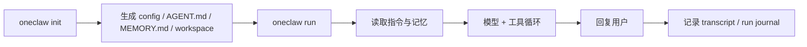

# oneclaw 架构优缺点与简单易用路线

本文从架构师视角评估当前 oneclaw 的优缺点，并给出面向「简单 / 易用」的改进路线。主流程与生命周期见 [architecture.md](architecture.md)，workflow 实现侧技术债见 [workflow-architecture-review.md](workflow-architecture-review.md)，目标需求以 [requirements.md](requirements.md) 为准。

---

## 1. 总体判断

oneclaw 当前方向是正确的：用 **文件真源**、**Go 单模块**、**每回合短生命周期 Engine**、**声明式 workflow** 与 **可扩展工具 / Agent** 组成一个可长期演进的 Agent 运行时。

主要风险也很清楚：底层能力已经偏完整，但默认体验还不够窄；新用户容易先接触到 Agent、Session、Turn、Engine、Workflow、ADK、Catalog、Memory、Workspace、Run journal、Async post-turn 等概念。若目标是简单易用，应把这些概念藏在默认路径后面，让用户先完成任务，再逐步理解高级能力。

建议对外心智压缩为：

> oneclaw = 本地 Agent + 文件记忆 + 工具执行 + **默认可固化的 skills（skill-creator + skill_generator）** + 可按需深入的 workflow。

### 1.1 **`skill-creator` 与能力固化（产品核心）**

**`skill-creator`** 不是可有可无的示例技能：它定义 **如何把用户反复遇到的问题** 抽象成 **`skills/<id>/`** 下的可复用规程（`SKILL.md`、可选脚本与参考文档），与内置 **`skill_generator`**、默认 workflow 里异步 **`skill_agent`** 一起，形成 **「从本轮执行痕迹里提炼 → 落盘 → 下轮 PreTurn / 工具再注入」** 的闭环。

因此 **`oneclaw init` 默认应带上 `skills/skill-creator/`**（嵌入模板拷贝，见 `setup/bootstrap.go`）。**简单易用**的目标主要是 **少讲框架名词、收窄 CLI 与错误提示**；**不**应以拿掉 **`skill-creator`** 为代价削弱「固化能力」这条主线。

---

## 2. 当前优点

### 2.1 架构边界清楚

代码包与设计文档中的职责基本对齐：

| 层级 | 主要包 / 目录 | 职责 |
|------|---------------|------|
| 入口 | `cmd/oneclaw` | CLI、serve、channel 等入口 |
| 回合调度 | `turnhub`、`runner` | 入站排队、会话串行、每轮执行 |
| 单轮运行 | `engine` | 当前回合运行时上下文 |
| 编排 | `workflow`、`wfexec` | YAML DAG 校验与 Eino Compose 执行 |
| 模型 | `adkhost` | Eino ADK 与模型适配 |
| 工具 | `tools`、`toolhost`、`tools/workspace` | 工具注册、过滤与执行 |
| 状态 | `session`、`memory`、`paths` | transcript、run journal、文件记忆、路径布局 |
| 横切 | `config`、`catalog`、`preturn`、`schedule`、`observe` | 配置、Agent Catalog、提示词拼装、定时、日志 |

这种分层说明项目不是临时堆叠，而是有明确运行时边界。

### 2.2 文档意识强

`docs/architecture.md`、`docs/reference-architecture.md`、`docs/workflows-spec.md`、`docs/workflow-architecture-review.md` 已形成从原则、主流程、规格到实现评审的闭环。尤其 workflow 评审文档主动记录复杂度、已完成收敛项和暂缓项，有利于避免实现和设计长期漂移。

### 2.3 文件真源适合本地 Agent

项目选择 `AGENT.md`、`MEMORY.md`、`agents/*.md`、`workflows/*.yaml` 作为用户可见真源，而不是把主要状态隐藏在数据库、向量库或模型上下文中。这有几个好处：

- 用户可以直接编辑和审计。
- 工具和 Agent 都围绕同一份文件状态工作。
- init 模板、版本控制、迁移和排错都更直接。
- 记忆与规则可以按预算注入，不需要无界历史回放。

### 2.4 每回合新 Engine 生命周期合理

TurnHub 管会话串行，每条入站创建新的 Engine，回合结束丢弃。这个模型避免长生命周期对象积累隐式状态，也降低并发共享风险。

---

## 3. 当前缺点与风险

### 3.1 对普通用户概念偏多

当前系统能力足够丰富，但概念面较宽。普通用户第一次使用时，不应被迫理解 workflow、DAG、ADK、Catalog 或 async post-turn。否则 oneclaw 会显得像一个 Agent 框架，而不是一个开箱可用的本地 Agent。

### 3.2 默认 workflow 心智偏复杂

`workflows/*.yaml` 具备 DAG、`async`、节点输出、context 引用等能力，适合扩展，但默认模板中若出现较多 no-op / 扩展位节点，会增加「哪一步真的有行为」的判断成本。

默认模板的目标应是：用户打开后能快速看懂一轮发生了什么。

### 3.3 `engine.RuntimeContext` 职责过重

workflow、ADK、会话文件、prompt data、node outputs、assistant 输出、异步 completion 等都集中在同一运行时对象上。短期可以工作，但长期会带来：

- 字段生命周期不直观。
- 测试需要构造过大的上下文。
- 异步与快照语义更难推理。
- 新功能容易继续向同一个结构追加字段。

### 3.4 默认路径还不够产品化

简单易用的最短路径应是：

```bash
oneclaw init
oneclaw run
```

并且失败时能给出可操作错误。当前底层能力已经多于用户第一步所需，下一阶段重点应从「继续扩能力」转向「收窄默认体验」。

### 3.5 文档多但入口未分层

`docs/` 适合架构评审和实现对照，但普通用户需要更短路径。建议区分用户文档、概念文档、开发者文档和架构文档，避免一上来就读完整设计套件。

---

## 4. 简单易用目标

### 4.1 默认主路径

默认体验应只暴露一条主路径：



**`skills/skill-creator/`** 随 **`oneclaw init`** 默认落盘，支撑 **skill_generator** 异步枝把重复模式写成 **`skills/<id>/`**，属于 **能力固化** 主轴，不要求用户先理解 workflow 细节。**workflow**、多 Agent、MCP、RAG、Harness 等仍可作为渐进式深入能力出现。

### 4.2 渐进式配置

建议把配置认知分为三层：

| 层级 | 面向用户 | 暴露内容 |
|------|----------|----------|
| Simple | 普通用户 | model、api key、workspace、memory on/off |
| Agent | 进阶用户 | agents、tools、permissions、subagents |
| Workflow | 高级用户 | `workflows/*.yaml`、async branches、node outputs |

CLI 和文档也应按这个顺序组织，而不是先解释 workflow。

### 4.3 对外命令建议

短期可优先补齐解释型命令，降低用户读文件成本：

```bash
oneclaw config show
oneclaw agent list
oneclaw agent new coder
oneclaw agent run reviewer "review current diff"
oneclaw workflow explain default.turn
```

`workflow explain` 尤其有价值：它应把 YAML 翻译成「准备提示词 → 主 Agent → 回复 → 后台记忆 / skills」这样的人话说明。

---

## 5. 改进路线

### 5.1 P0：收窄默认体验

- `oneclaw init` 在**不牺牲能力固化**的前提下控制噪音：**`//go:embed templates` 嵌入 `setup/templates/` 整树**，`Bootstrap` 遍历拷到 UserDataRoot（缺才写；**`config.yaml`** 仍单独合并；**`agents/default.md`** 仍模板渲染）；**预建** `prompts/`、`knowledge/sources/`；**`tools.exec` 默认保持开启**（仍应在生产环境收窄 allow/deny）。仓库 **`examples/skills/`** 等与嵌入树对齐，便于浏览与文档引用。
- `oneclaw run` 在 mock 与真实模型两种模式下都给出清晰提示。
- 默认 workflow 只保留真正有行为或必须保留的节点。
- 占位 / 扩展位 workflow 移到 example 或高级文档。

### 5.2 P1：增强 explain 与诊断

- `config show`：展示最终合并配置，并隐藏敏感值。
- `agent list`：展示内置与用户 Agent、工具白名单、模型覆盖。
- `workflow explain`：将 DAG 输出为阶段化说明。
- 配置、workflow、工具、workspace、模型 endpoint 错误都应包含「发生了什么 / 为什么失败 / 怎么修 / 相关路径」。

### 5.3 P2：拆分 `RuntimeContext`

先拆结构，不急着大改包边界。建议目标形态：

| 结构 | 职责 |
|------|------|
| `TurnState` | 当前回合输入、assistant 输出、错误状态 |
| `SessionState` | transcript、run journal、session paths |
| `WorkflowState` | node outputs、current params、async completions |
| `PromptState` | prompt template data、memory snapshot、skills digest |
| `RuntimeServices` | model、tools、catalog、logger、clock |

拆分完成后，再逐步收紧并发和异步不变式。

### 5.4 P3：再扩高级能力

RAG、MCP、浏览器工具、Harness 治理等都可以继续保留在 roadmap 中，但不应压过 P0 / P1 的默认体验改造。底层可以强，默认路径必须窄。

---

## 6. 文档分层建议

建议后续把文档入口整理为：

| 文档 | 面向读者 | 内容 |
|------|----------|------|
| `README.md` | 普通用户 | 5 分钟上手 |
| `docs/user-guide.md` | 日常使用者 | init、run、配置、常见错误 |
| `docs/concepts.md` | 进阶用户 | Agent、Session、Memory、Tool、Workflow |
| `docs/architecture.md` | 架构 / 实现 | 主流程与生命周期 |
| `docs/dev-guide.md` | 贡献者 | 如何加工具、加节点、加入口 |
| `docs/workflow-architecture-review.md` | 实现评审 | workflow 技术债与优化路线 |

当前文档质量较高，问题不是缺文档，而是需要为不同读者设置入口。

---

## 7. 优先级结论

建议按以下顺序推进：

1. **先简化默认体验**：`init` 后直接可跑，默认 workflow 可读。
2. **再做 explain 工具**：`config show`、`agent list`、`workflow explain`。
3. **然后拆 `RuntimeContext`**：先结构拆分，再收紧异步和 journal 契约。
4. **最后扩展高级能力**：MCP、RAG、浏览器、Harness 治理。

一句话原则：

> 底层能力可以完整，但用户第一眼必须简单；架构可以强，但默认路径必须窄。

---

| 日期 | 变更 |
|------|------|
| 2026-05-05 | 首版：整理架构优缺点与简单易用改进路线 |
