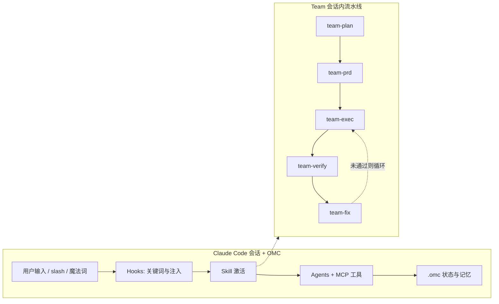

# oh-my-claudecode（OMC）能力整理

> **范围**：本文档位于 [`docs/third-party/`](README.md)，属**第三方项目调研**，不是 oneclaw 设计规格。

本文基于仓库内 **`third_repo/oh-my-claudecode`** 源码与文档整理，用于对照 **Claude Code** 生态中 OMC 提供的**能力增强、预制 Skill、典型流程**。  
**版本参考**：该目录 `package.json` 中版本号（整理时约为 **4.12.x**）；上游以 [oh-my-claudecode](https://github.com/Yeachan-Heo/oh-my-claudecode) 官方仓库为准，能力会随版本增减。

---

## 1. 定位：它为 Claude Code 带来什么

| 维度 | 说明 |
|------|------|
| **产品形态** | Claude Code **插件（Marketplace）** + 可选 **npm 全局 CLI**（包名 **`oh-my-claude-sisyphus`**，命令 `omc`）。 |
| **运行时依赖** | 基于 **`@anthropic-ai/claude-agent-sdk`**，在 **Claude Code 会话**内扩展行为，**不是**独立 HTTP Agent 服务。 |
| **核心价值** | 在默认「单会话 + Task 子代理」之上，增加 **Hooks 生命周期扩展、预制 Skill、多角色 Agent、MCP 工具面、状态与记忆目录（`.omc/`）、Team 编排（会话内 + 可选 tmux CLI）**。 |

官方架构文档用四条链概括：**Hooks（事件）→ Skills（行为注入）→ Agents（执行）→ State（跨轮/压缩后持久化）**（见上游 `docs/ARCHITECTURE.md`）。

---

## 2. 相对「裸 Claude Code」的能力增强（非 Skill 清单）

### 2.1 Hooks：挂在 Claude Code 生命周期上

OMC 在 `hooks.json` 中注册若干脚本，响应 **UserPromptSubmit、SessionStart、PreToolUse、PostToolUse、PreCompact、Stop** 等事件（上游文档列 **11 类生命周期事件**）。

- **典型能力**：魔法关键词检测、Skill 指令注入、持久模式在 **Stop** 时「续跑」提示、子代理起止追踪、compact 前写入 notepad、权限与结果校验等。
- **关闭方式**：`DISABLE_OMC=1` 全关；`OMC_SKIP_HOOKS` 按名跳过（见上游 `docs/HOOKS.md` / `docs/ARCHITECTURE.md`）。

### 2.2 MCP 工具（会话内 agent 使用）

通过 **OMC Tools Server** 聚合暴露多类工具（可按类别用环境变量关闭，如 `OMC_DISABLE_TOOLS`）。上游 `docs/TOOLS.md` 中的大类包括：

- **State**：各执行模式（autopilot / ralph / ultrawork 等）的进度状态读写。
- **Notepad / Project Memory**：压缩抗性笔记与项目级长期记忆。
- **LSP / AST Grep**：类 IDE 的语义诊断与结构化搜索替换。
- **Python REPL**：持久 Python 执行环境。
- **Session Search / Trace**：历史会话检索与流程追踪。
- **Shared Memory**：多智能体协作时的共享状态。
- **Skills / Deepinit Manifest / Wiki** 等内部或辅助类工具。

具体工具名与参数以上游 `docs/TOOLS.md` 与 `src/mcp/omc-tools-server.ts` 为准。

### 2.3 预制 Agent（子代理类型）

上游 `agents/` 目录当前为 **19 个** Markdown 定义，角色覆盖探索、需求分析、规划、架构、实现、调试、验证、安全/代码评审、测试、设计、文档、数据科学、Git、专项简化与 **critic** 等（与 `docs/ARCHITECTURE.md` 中「多 lane + 模型档位」描述一致）。  
委派时通常以 **`oh-my-claudecode:<agent-name>`** 形式与 **Task** 工具配合。

### 2.4 状态与数据面（`.omc/`）

- **控制面**：`.omc/state/**` 存放队列、团队、会话、interop 信封等元数据。
- **数据面**：`.omc/notepad.md`、`.omc/notepads/{plan}/`（learnings/decisions/issues/problems）、`project-memory`、plans、prompts、logs 等；部分模式另有 **`~/.omc/state/`** 作为全局备份（见上游 `docs/ARCHITECTURE.md` State 一节）。
- **团队阶段产物**：插件内 `templates/deliverables.json` 约定 **Team 流水线各阶段** 的交付物检查（如 `DESIGN.md`、`PRD.md`、`QA_REPORT.md` 等最小规模与章节）。

### 2.5 其他增强特性（摘要）

- **委托类别（Delegation Categories）**：从任务语义映射 **模型档位、温度、thinking budget**（见 `docs/shared/features.md` / `docs/FEATURES.md` 内 API 说明）。
- **目录级诊断**：整仓 TypeScript 质量检查（`tsc` / `lsp` / `auto`）。
- **Verification**：可复用的验证协议与档位选择（`src/verification/`、`docs/shared/verification-tiers.md`）。
- **Session Resume**：`resume-session` 等与会话续接相关的工具能力（见上游功能说明）。
- **Pipeline 预设**：顺序多阶段 agent 链与自定义 `/pipeline ...` 语法（见 `docs/shared/features.md`）。

---

## 3. 预制 Skill（`skills/` 目录）

Skill 在 OMC 中是 **行为注入**：通过 **slash（如 `/oh-my-claudecode:<skill>`）**、**自然语言魔法词** 或 **Hooks 注入** 激活。上层文档常描述为 **三层组合**：可选 **保证层（如 ralph）** + **若干增强层** + **执行层（如 default / orchestrate / planner）**，公式为：`[执行层] + [0–N 增强] + [可选保证]`（`docs/ARCHITECTURE.md`）。

以下为 **`third_repo/oh-my-claudecode/skills/`** 下一级目录名列表（**随上游版本变化**），按用途粗分：

| 类别 | Skill 目录名 |
|------|----------------|
| **编排 / 执行模式** | `team`、`autopilot`、`ralph`、`ralplan`、`ultrawork`、`ultraqa`、`plan`、`ccg`、`omc-teams` |
| **深度需求 / 研究** | `deep-interview`、`deep-dive`、`ask`、`external-context`、`sciomc` |
| **工程与质量** | `verify`、`visual-verdict`、`debug`、`trace`、`release`、`cancel` |
| **项目与会话治理** | `setup`、`omc-setup`、`mcp-setup`、`omc-doctor`、`omc-reference`、`configure-notifications`、`project-session-manager`、`remember`、`wiki` |
| **资产与规范** | `deepinit`、`skill`、`skillify`、`learner`、`self-improve`、`writer-memory`、`ai-slop-cleaner` |
| **界面与工具** | `hud` |

**说明**：

- 官方 README 与架构文对 **Skill 数量** 的表述可能为「约 31」或营销口径「更多」，**以 `skills/` 实际目录为准**。
- 部分名称在 README 中写作 **`/omc-teams`**，与终端 **`omc team`** 为不同表面（会话技能 vs CLI）。

---

## 4. 执行模式与魔法词（用户可见流程入口）

README（含中文版）中的典型 **执行模式** 如下（与 Skill 强相关）：

| 模式 | 要点 |
|------|------|
| **Team（推荐）** | 会话内多智能体 + **阶段流水线**（见 §5）。需启用 Claude Code **Experimental Agent Teams**。 |
| **omc-teams / CLI team** | **tmux** 中拉起 **codex / gemini / claude** 等 CLI worker，任务结束即退出。 |
| **ccg** | **Codex + Gemini** 并行，**Claude** 侧汇总。 |
| **Autopilot** | 端到端自主多阶段交付（自然语言如 `autopilot: ...`）。 |
| **Ultrawork** | 高并行；关键词 `ulw` 等。 |
| **Ralph** | 持久循环直至验证通过；常与 ultrawork 行为叠加说明见 README。 |
| **Pipeline** | 严格顺序多阶段（含预设 `review` / `implement` / `debug` 等，见 `docs/shared/features.md`）。 |
| **Swarm / Ultrapilot** | 旧入口；新版本多 **路由到 Team**。 |

**魔法词示例**（节选，完整表见上游 `README*.md` 与 `docs/ARCHITECTURE.md`）：`team`、`omc-teams`、`ccg`、`autopilot`、`ralph`、`ulw`、`plan`、`ralplan`、`deep-interview`、`cancelomc` / `stopomc` 等。  
部分触发逻辑在 **keyword-detector Hook** 中硬编码，**不能**仅靠 `config.jsonc` 的 `magicKeywords` 覆盖（架构文档有说明）。

---

## 5. Team 流水线与交付物（流程）

### 5.1 会话内 Team 阶段（Claude Code 原生 Teams）

标准描述为：

**`team-plan → team-prd → team-exec → team-verify → team-fix`（循环）**

启用方式：用户 `settings.json` 中设置 **`CLAUDE_CODE_EXPERIMENTAL_AGENT_TEAMS=1`**；未启用时 OMC 可能警告并尽量降级执行。

### 5.2 与 `deliverables.json` 的对应关系

插件模板 `templates/deliverables.json` 定义各阶段**最小交付物**（用于 verify 类 Hook），摘要如下：

| 阶段 | 交付物要点 |
|------|------------|
| **team-plan** | `DESIGN.md`，最小体积与章节如「File Ownership」「Architecture」 |
| **team-prd** | `PRD.md`、`TEST_STRATEGY.md` |
| **team-exec** | 无固定文档交付物（以代码变更为准） |
| **team-verify** | `QA_REPORT.md`，含 PASS/FAIL 等模式 |
| **team-fix** | 无固定文档交付物 |

### 5.3 流程总览（概念图）

### 5.4 终端 CLI（`omc`）与会话内 Skill 的分工

| 能力 | 终端 `omc ...` | 会话内 Skill |
|------|----------------|----------------|
| 安装与诊断 | `omc setup`、`omc doctor` 等 | `/setup`、`/omc-setup`、`/omc-doctor` |
| Team | `omc team N:codex "..."`（tmux workers） | `/team ...`（原生 Teams 流水线） |
| Autopilot / Ralph / Ultrawork 等 | **通常无**同名子命令 | `/autopilot`、`/ralph` 等 |

---

## 6. 与 oneclaw 文档的关系

- 本文 **仅描述 OMC 上游能力**，**不是** oneclaw 的实现规格。
- 若关心 oneclaw 与 Claude Code 范式对照，见 [`claude-code-vs-oneclaw.md`](claude-code-vs-oneclaw.md) 与 [`../runtime-flow.md`](../runtime-flow.md)。

---

## 7. 参考路径（本仓库 third_repo）

| 路径 | 内容 |
|------|------|
| `third_repo/oh-my-claudecode/docs/ARCHITECTURE.md` | 架构、Skill 层、Hooks、State 目录 |
| `third_repo/oh-my-claudecode/docs/HOOKS.md` | Hook 清单与事件 |
| `third_repo/oh-my-claudecode/docs/TOOLS.md` | MCP 工具分类 |
| `third_repo/oh-my-claudecode/docs/shared/features.md` | Session Notepad、Pipeline 预设、状态路径等 |
| `third_repo/oh-my-claudecode/README.md` / `README.zh.md` | 快速开始、模式表、魔法词 |
| `third_repo/oh-my-claudecode/skills/` | 预制 Skill 目录 |
| `third_repo/oh-my-claudecode/agents/` | 预制 Agent 定义 |
| `third_repo/oh-my-claudecode/templates/deliverables.json` | Team 阶段交付物约束 |
