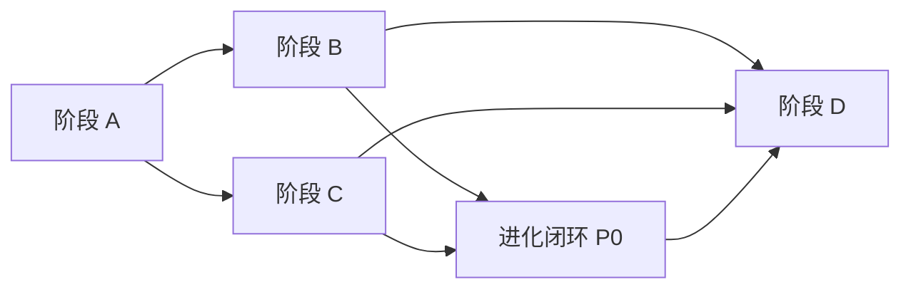

# Go Agent Runtime — 任务清单

勾选表示完成。详细说明与验收口径见 [`go-runtime-development-plan.md`](go-runtime-development-plan.md)、[`agent-runtime-golang-plan.md`](agent-runtime-golang-plan.md)。

**「可自我学习 / 进化」在本项目中的含义**（见 `agent-runtime-golang-plan.md`）：**文件型记忆平面持续更新** + **规则/策略可写回磁盘** + **维护型子任务整理**，而非训练模型权重。下列完成度按此目标评估。

---

## 工程基线（开工前）

- [x] 新建 Go 模块仓库；全局使用 `log/slog`；目录不使用 `internal`（按团队约定）
- [ ] 新功能开发前阅读对应设计：`claude-code-main-flow-analysis.md`、`claude-code-memory-system.md` 等（见 [`README.md`](README.md)）
- [x] **全局 token / 字节预算**：`budget` + `ONCLAW_MAX_PROMPT_BYTES`（默认 220000）约束注入裁剪与每步 transcript；子 Agent / fork 共用；`ONCLAW_DISABLE_CONTEXT_BUDGET=1` 关闭

---

## 阶段 A — 最小闭环

**验收**：同 session 多轮对话 + 多轮工具调用；Abort 可停；transcript 可序列化/持久化。

- [x] **A1** 统一消息模型：user / assistant / tool_use / tool_result / attachment；compact boundary 占位
- [x] **A2** 会话编排：每轮输入 → transcript → 进入 query；跨轮保留 messages、usage、abort
- [x] **A3** query 循环：模型 → tool_use → 执行 → tool_result 回灌 → 无 tool 或达上限/预算则结束
- [x] **A4** 模型后端：选定一种供应商；流式响应；解析 tool 调用块
- [x] **A5** 工具注册与执行：JSON schema、按名查找、`CanUseTool` 类钩子；只读并行、写串行
- [x] **A6** 最小工具：Read；Write 或 StrReplace；Grep；Bash（cwd / 超时 / 策略）
- [x] **A7** `ToolUseContext`：abort、只读缓存、权限上下文；nested memory、子 Agent 相关字段已接好
- [x] **A8** 测试与入口：消息往返单测；CLI 或 REPL 式多轮对话 demo

---

## 阶段 B — Memory 全链路

**验收**：切换目录/scope 发现正确；下一轮能注入更新后的 memory；recall 不爆 token。

- [x] **B1** 存储与路径：user / project / local / agent / team scope；`MEMORY.md` 索引；topic 文件；daily log append
- [x] **B2** `MEMORY.md` 截断：行数上限 + 字节上限 + 截断提示文案
- [x] **B3** 发现层：自 cwd 向上查找 `AGENT.md`、`.oneclaw/rules/*.md`、memory 根
- [x] **B5** 注入与 recall：system 前缀拼装；recall → attachment；surfaced 字节上限、路径去重
- [x] **B6** 在线更新：工具可写 topic、`MEMORY.md`、daily log
- [x] **B7** extract / dream：**主干已接** — daily log + **默认开启**的回合后维护 `memory.MaybeMaintain`；**定时**入口 `go run ./cmd/maintain`（默认按 `ONCLAW_MAINTAIN_INTERVAL` 常驻循环，默认 1h；cron 用 `-once` 或间隔 `0`）。维护模型可选：`ONCLAW_MAINTENANCE_MODEL` / `ONCLAW_MAINTENANCE_SCHEDULED_MODEL`（未设则回退主会话模型）。写 **project `MEMORY.md`** `## Auto-maintained (日期)`，按日去重。尚未做：多文件 topic 合并、强去重

---

## 阶段 C — 子 Agent 与隔离

**验收**：主 transcript 不被子任务撑爆；fork 与全量子 Agent 两条路径符合设计文。

- [x] **C1** Agent 定义加载：`.oneclaw/agents/*.md` + 内置 `general-purpose` / `explore`
- [x] **C2** 嵌套调用：`run_agent` 内独立 `loop.RunTurn`；子级 `ToolUseContext` 默认隔离（独立读缓存、深度计数）
- [x] **C3** Fork：`fork_context` 共享本回合父级 `ParentSystem` + 裁剪父消息尾部
- [x] **C4** sidechain transcript：`.oneclaw/sidechain/*.jsonl` 落盘；**可选合并回主会话** — 未做（仅旁路存储）
- [x] **C5** 权限：`fork_context` 子路径禁 `bash`；嵌套时剥离 `run_agent`/`fork_context`；`run_agent` 仍走父级 `CanUseTool`（未单独做「子 Agent 一律更严」的二次策略，可按 Agent 类型加强）

---

## 阶段 D — 运维与可选能力

- [x] **D1** 维护调度：**独立进程/定时**触发 dream / extract（或 idle 触发）；失败 `slog`；与当前「仅 PostTurn 写 log」区分
- [x] **D2** 变更审计：memory 写入可追溯（append-only 审计 log，或文档化「依赖 git diff」的流程）
- [ ] **D3**（可选）向量 recall：插件接口；文件仍为真源

---

## 目标导向：自我进化闭环（建议在 D 之前穿插）

> 对应 `agent-runtime-golang-plan.md` 第 5 节示意：daily log →（dream）→ memory 平面 → 下一轮注入。

| 优先级 | 项 | 说明 |
|--------|-----|------|
| P0 | **模型化维护管道** | [x] 回合后 `MaybeMaintain`（见上）；[x] **定时/idle**（`cmd/maintain` 默认常驻 + `ONCLAW_MAINTAIN_INTERVAL`，`-once` / `0` 单次）；[ ] 读多段 log、写 topic / 强去重 |
| P0 | **全局上下文预算** | [x] `budget` 包 + `loop` 每步裁剪 + 注入 `ApplyTurnBudget`；估算为 **JSON 字节** 非精确 token |
| P1 | **侧链合并（可选）** | 将 sidechain 中「用户显式关心的结论」以 attachment 或单条 user 摘要合入主 transcript（产品化选项） |
| P1 | **行为策略写回** | 明确引导/工具：把验证有效的规则写入 `.oneclaw/rules` 或 `AGENT.md` 的路径与护栏（与 D2 审计衔接） |
| P2 | **D1/D2/D3** | D1/D2 已接；D3 向量 recall 按上表阶段 D |
| 后置 | 完整 MCP、复杂 compact / 全量遥测 | 保持刻意后置 |

---

## 刻意后置（勿在 A 阶段展开）

- [ ] 完整 MCP 客户端与 UI 级权限流
- [ ] 复杂 compact / 全量遥测

---

## 依赖关系（执行顺序）

建议：**在补全 P0（模型化维护 + 全局预算）后**，再主攻 D1/D2；向量与 MCP 按产品需要排期。

---

## 完成度快照（相对「自我进化 bot」）

| 维度 | 状态 | 备注 |
|------|------|------|
| 对话 + 工具 + transcript | 高 | 阶段 A |
| 记忆发现 / 注入 / recall / 在线写 | 高 | 阶段 B |
| 时间序列沉淀（daily log） | 中 | 有落盘，缺自动蒸馏回索引层 |
| 子 Agent / fork / 侧链 | 中高 | 阶段 C 主干已有；合并回主会话未做 |
| 自动进化闭环（log → 整理 → 再注入） | 低 | 需 P0 管道 + 可选 D1 |
| 可观测与合规（审计、预算） | 中 | 预算已有；D2 审计 JSONL + 可选 git |
