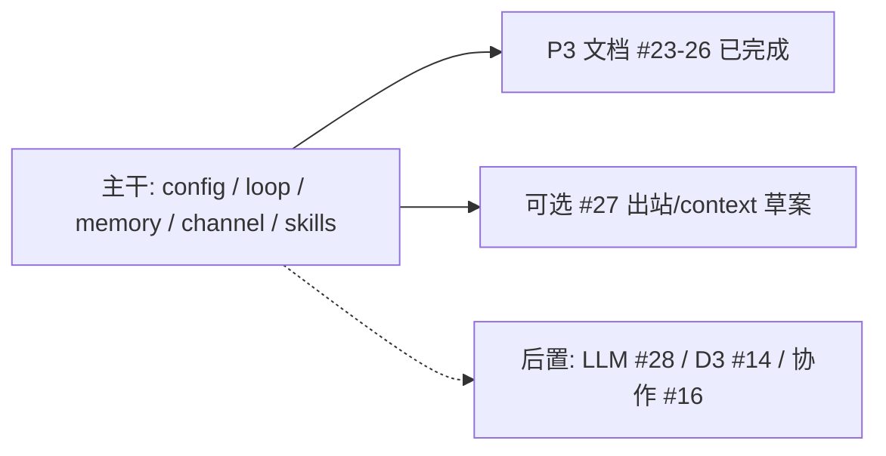

# Go Agent Runtime — 任务清单

勾选表示完成。验收口径与包布局见 [`agent-runtime-golang-plan.md`](agent-runtime-golang-plan.md)。

**「可自我学习 / 进化」**：文件型记忆更新 + 规则写回磁盘 + 维护子任务整理（非训练权重）。

---

## 未完成任务一览（相对代码现状）

以下为**仍未完成**或**明确续作**；**统一编号与勾选以下方「统一 backlog」为准**，避免与本表冲突。

| 优先级 | 项 | 说明 |
|--------|-----|------|
| **P2** | D3 向量 recall | 插件接口，文件仍为真源（backlog **#14**） |
| **P2（续作）** | 预算 / tokenizer 更精细 | UTF-8 与 YAML 段上限已接（**#15** `[x]`）；多模型 tokenizer 级用量与裁剪一致性可加强 |
| **P2** | 协作模型（teammate / swarm） | mailbox、长期成员等（**#16**） |
| **后置** | 多 LLM / 多协议 | [`multi-llm-provider-design.md`](multi-llm-provider-design.md)；**#28** |
| **后置** | MCP **续作** | 客户端主干 **#30** `[x]`；discovery、UI 级权限流、Server 暴露等见 **刻意后置** 与 #30 条文 |
| **后置** | compact 高级、全量遥测、MCP 其余 | **#29** 等；刻意控制范围 |
| **P1 续作** | Skills 加深 | 审计、条件 paths、动态子目录（主干 **#8** `[x]`）；见 [`third-party/claude-code-skills-mechanism.md`](third-party/claude-code-skills-mechanism.md) |
| **P3 文档** | Routing / 渠道 / Engine | **#23–#25** `[x]`（见 [`inbound-routing-design.md`](inbound-routing-design.md) §5–§8、`config.md`「会话与多通道」） |
| **P3 文档** | 子 agent 工具表说明 | **#26** `[x]`（[`inbound-routing-design.md`](inbound-routing-design.md) §9） |
| **P3 文档** | 架构抽象路线 | [`architecture-modularity-simplification.md`](architecture-modularity-simplification.md) §1–§6；与 backlog 对照见 **本文 §「架构模块化：backlog 对照」** |
| **后置/可选** | 出站与 `context` 演进（未实现） | **#27**，见 **下文 §「出站与 context 可选演进（未实现）」** |

**习惯**：新功能前查阅 [`README.md`](README.md) 索引中的设计文档（持续执行，不单列版本项）。

---

## 优先级原则

| 层级 | 含义 |
|------|------|
| **P0** | 安全与记忆闭环、长会话可用、核心工具吞吐 |
| **P1** | 多渠道、Skills、策略沉淀、子 Agent、任务恢复 |
| **P2** | 体验细化、可选 recall、预算细化、多实体协作 |
| **后置** | 多 LLM、MCP 续作、compact 高级、全量遥测 |

---

## 统一 backlog（单一真相）

> 同层自上而下；`[x]` 仅作锚点。

### P0

1. `[x]` **统一 config 模块** — 见 [`config.md`](config.md)。
2. `[x]` **模型化维护管道收口** — topic 合并、去重等。
3. `[x]` **语义 compact（最小可用）** — 摘要 + 边界 + 最近 K 轮。
4. `[x]` **受控并行 tool 调用** — 只读并行、写串行。
5. `[x]` **Glob / 列表工具** — `pathutil` 一致。
6. `[x]` **全局上下文预算** — `budget` + `ApplyTurnBudget`。

### P1

7. `[x]` **通用 Channel 抽象** — 见 [`inbound-routing-design.md`](inbound-routing-design.md)。
8. `[x]` **Skills** — `skills` 包、`invoke_skill`、`skills-recent.json`；`features.disable_skills`。续作见上表 P1。
9. `[x]` **行为策略写回** — `.oneclaw/rules` / `AGENT.md`。
10. `[x]` **任务状态工具** — task 创建/更新落盘。
11. `[x]` **侧链合并（可选）** — `sidechain_merge`。
12. `[x]` **Cron / 维护周期** — `maintain.interval` + `maintainloop`；`cron` 工具 + `scheduled_jobs.json`；`-maintain-once` / `maintain -once`。见 [`embedded-maintain-scheduler-design.md`](embedded-maintain-scheduler-design.md)。

### P2

13. `[x]` **入口编排加厚** — `Inbound` 附件、`Locale`、本地 slash、`statichttp` 等。
14. `[ ]` **D3 向量 recall** — 插件接口；文件真源。
15. `[x]` **预算精度** — UTF-8 与各段上限；usage 落盘，见 [`config.md`](config.md)。
16. `[ ]` **协作模型（teammate / swarm）**

### 工程简化（[`code-simplification-opportunities.md`](code-simplification-opportunities.md)）

19. `[x]` **subagent 前置去重** — `subagent/run.go`。
20. `[x]` **channel 出站 drain** — `DrainTextReply` / `statichttp`。
21. `[x]` **PostTurnInput 复用** — `SubmitUser` 尾部共用。
22. `[x]` **Emitter `context` 统一** — `loop` 与本地 slash 注释对齐。

### 文档与小修（P3）

23. `[x]` **文档：工具 `DefaultRegistry` 与出站**
24. `[x]` **文档：出站主路径与可选演进分流**（可选实现草案见 **#27** §）
25. `[x]` **文档：`WorkerPool` / `Engine` 会话模型**
26. `[x]` **文档：子 agent 工具表**

### 后置

27. `[ ]` **可选：出站与 `context` 演进** — 草案见 **下文 §「出站与 context 可选演进（未实现）」**（`OutboundSender`、`context.Value`、`SinkRegistry`/`SinkFactory` 等）。
28. `[ ]` **多 LLM / 多协议** — [`multi-llm-provider-design.md`](multi-llm-provider-design.md)（Phase 0–3）。
29. `[ ]` **compact 高级**、**全量遥测**
30. `[x]` **MCP 工具（客户端主干）** — `mcpclient` + YAML；前缀 `mcp_*`；续作：discovery、UI 权限、mediastore 对齐、进程内 MCP Server 等。

---

## 出站与 context 可选演进（未实现）

**当前实现真源**以 [`inbound-routing-design.md`](inbound-routing-design.md) §4「出站（当前实现）」为准。以下为**尚未落地**的设计草案，与 **backlog #27** 对照；实施前再定优先级。

### `context` 透传入站元数据

若将来 **Sink** 或工具需要从 `context` 读取本轮入站元数据、又不想扩展函数签名，可在 **`loop.RunTurn`** 开头写入一次 `context.Value`（非导出 key），或在本轮构造时闭包进 `PublishOutbound` 所用参数。

| 适合放入 `ctx` | 不适合 |
|----------------|--------|
| 不可变的本次请求元数据（来源、用户 id、correlation、trace id） | 大段正文重复存储 |
| 供工具使用的**句柄 key**（lookup key） | 密钥明文、长期 token 本体 |
| 取消 / 超时（仍用 `ctx` 的 `Deadline` / `Done`） | 把 `Engine` 或整条消息历史塞进 `Value` |

### `SinkRegistry` / `SinkFactory`

按 `ClientID` 等键维护**注册表或工厂**，在构造 `bus.OutboundMessage` 前做一层出站解析；与上一节 `context` 透传可二选一或组合。**代码中未作为单一主路径实现。**

### `OutboundSender` 与 `Engine.SendMessage`

编排层 **`Engine.SendMessage`** 依赖 CWD、`SessionID` 等，不宜做成无状态包级接口。较稳妥：**收窄接口 + 已有 `toolctx` 分组**，或 **`context` 挂载窄 `OutboundSender`**，与 `toolctx.SessionHost.SendMessage` 二选一演进，避免与「全局 `Engine` 单例」并行两套。

---

## 架构模块化：backlog 对照

与 [`architecture-modularity-simplification.md`](architecture-modularity-simplification.md) **§1–§6**（分层、抽象方向、原则、后置拆库）配套：**勾选与编号以本文「统一 backlog」为准**；下表说明各条目与架构主题的映射。

### 工程简化已完成（#19–#22）与架构关系

| # | 内容 | 与架构文档 |
|---|------|------------|
| **#19** | subagent 前置去重 | 子路径一致、`Engine` 分支复杂度下降 |
| **#20** | channel 出站 `Drain` | 出站收敛，利于后续接口化 |
| **#21** | `PostTurnInput` 复用 | `PostTurn`/维护共享快照，单一数据流 |
| **#22** | Emitter `context` 统一 | Turn 生命周期与取消语义对齐 |

### P3 文档（#23–#26）与架构章节

| # | 内容 | 对应 `architecture-modularity-simplification` |
|---|------|--------------------------------------------------|
| **#23** | 工具 `builtin.DefaultRegistry` vs 出站 | §3.2、[inbound-routing-design.md](inbound-routing-design.md) §5 |
| **#24** | 出站主路径与可选演进分流（文档） | §3.2、[inbound-routing-design.md](inbound-routing-design.md) §3–§4；可选草案 **#27** § |
| **#25** | `WorkerPool` + 每任务 `Engine` vs 单测直接 `NewEngine` | §3.1、§4、[inbound-routing-design.md](inbound-routing-design.md) §8 |
| **#26** | 子 agent 工具表（catalog ∩ 过滤 − meta） | §4、[inbound-routing-design.md](inbound-routing-design.md) §9 |

### 可选代码演进（#27）

| # | 内容 | 对应 |
|---|------|------|
| **#27** | 出站与 `context` 演进（见 **上文 §「出站与 context 可选演进（未实现）」**） | 架构 §3.1、[inbound-routing-design.md](inbound-routing-design.md) §3 |

### 架构 §3 建议项（尚无独立 backlog 编号）

落实时在本文件 **新增** backlog 条目，或挂在某次 P3 文档 PR 的「跟进代码」子任务。

| 主题 | 建议动作 | 备注 |
|------|----------|------|
| **Engine 依赖面** | 出站 / 维护触发 / schedule 门控 → 可注入接口或显式字段 | 可与 **#27** 同轮设计，避免两套全局 `Engine` |
| **Memory 读/写** | 注释或类型别名区分「本轮装配读」与「回合后写」 | 为后续 MemoryPlane 打楔子 |
| **Notify** | 回调内不拉 `memory`/`session` 重逻辑 | [`notification-hooks-design.md`](notification-hooks-design.md) |

### 非「抽象优先」的 backlog（避免与边界整理混排）

| # | 说明 |
|---|------|
| **#14** | D3 向量 recall：能力增强，非边界简化 |
| **#16** | teammate / swarm：产品形态扩展 |
| **#28** | 多 LLM：后置迁移，与收窄 `Engine` 风险面不同 |
| **#29**、**#30 续作** | 遥测、MCP discovery/UI 等（**#30 主干**已 `[x]`） |

---

## 工程基线（已满足）

Go 模块、`log/slog`、目录不用 `internal`（团队约定）、全局 `budget` / `PushRuntime` — 见 [`README.md`](../README.md)、[`config.md`](config.md)。

---

## 配置与扩展（速查）

| 项 | 状态 | 索引 |
|----|------|------|
| 统一 config | [x] | #1、[`config.md`](config.md) |
| Channel / 入站抽象 | [x] | #7、[`inbound-routing-design.md`](inbound-routing-design.md) |
| Skills 主干 | [x] | #8；续作见上表 |
| 多 LLM | [ ] | #28、[`multi-llm-provider-design.md`](multi-llm-provider-design.md) |
| MCP 客户端主干 | [x] | #30 |

---

## 阶段 A–D（归档）

阶段验收细节与历史勾选已并入日常开发；若需逐条对照，见 [`agent-runtime-golang-plan.md`](agent-runtime-golang-plan.md) 阶段表。

| 阶段 | 状态 | 要点 |
|------|------|------|
| **A** | 完成 | 消息模型、query 循环、工具、CLI/REPL |
| **B** | 完成 | Memory 路径、发现、注入、recall、在线写、维护管道 |
| **C** | 完成 | 子 Agent、`run_agent`、fork、侧链、`sidechain_merge` |
| **D** | D1/D2 完成 | 维护调度、变更审计；**D3** 向量 recall → **#14** |

---

## 目标导向：自我进化闭环

示意见 [`agent-runtime-golang-plan.md`](agent-runtime-golang-plan.md) §5（daily log → 维护 → memory → 再注入）。**闭环完成度以本文「统一 backlog」为准。**

---

## 刻意后置

- [ ] 多 LLM / 多协议（**#28**）
- [x] MCP 客户端主干（**#30**）
- [ ] MCP UI 级权限流等续作
- [ ] compact 高级形态
- [ ] 全量遥测

---

## 依赖与演进说明（当前）

P0/P1 主干与阶段 A–C 已落地；**进行中**主要为可选 **#27**（出站 / `context` 草案）、产品与后置项（**#14、#16、#28、#29** 等）。P3 文档 **#23–#26** 已勾选；工程简化 **#19–#22** 已完成；**与架构主题的逐项对照**见 **上文「架构模块化：backlog 对照」**。

分层与抽象原则见 [`architecture-modularity-simplification.md`](architecture-modularity-simplification.md)；代码级简化见 [`code-simplification-opportunities.md`](code-simplification-opportunities.md)。

---

## 完成度快照

| 维度 | 备注 |
|------|------|
| 对话 + 工具 + transcript | 高 |
| Memory 发现 / 注入 / recall / 写 | 高；向量 recall 可选 **#14** |
| 维护与 daily log | 中高 |
| 子 Agent / fork / 侧链 | 中高 |
| 审计与预算 | 中高；遥测后置 |
| Skills | 中高；续作见上表 |

---

*编号 #1–#30 保持稳定，便于交叉引用；若新增条目，在统一 backlog 末尾顺延并更新本文「未完成任务一览」。*
