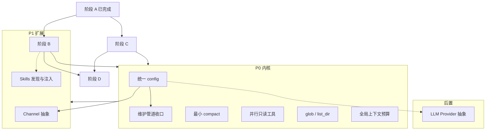

# Go Agent Runtime — 任务清单

勾选表示完成。详细说明与验收口径见 [`go-runtime-development-plan.md`](go-runtime-development-plan.md)、[`agent-runtime-golang-plan.md`](agent-runtime-golang-plan.md)。

**「可自我学习 / 进化」在本项目中的含义**（见 `agent-runtime-golang-plan.md`）：**文件型记忆平面持续更新** + **规则/策略可写回磁盘** + **维护型子任务整理**，而非训练模型权重。下列完成度按此目标评估。

---

## 未完成任务一览（相对代码现状）

以下为**尚未在统一 backlog 中勾选**或**明确列为续作**的工作，按优先级归类；细节仍以下方「统一 backlog」为准。

| 优先级 | 项 | 说明 |
|--------|-----|------|
| **P2** | ~~入口编排加厚~~（已做主干） | slash 本地命令、`Inbound` 元块、附件、`statichttp`/`InboundTurn` 透传；IM 侧可再迭代 |
| **P2** | D3 向量 recall | 插件接口，文件仍为真源 |
| **P2** | 预算精度（可选） | usage / tokenizer 类估算，多模型下裁剪更一致 |
| **P2** | 协作模型（teammate / swarm） | mailbox、长期成员等；按需排期 |
| **后置** | LLM 类型可扩展 | Provider / Transport 抽象，配置与实现解耦 |
| **后置** | 完整 MCP、compact 高级形态、全量遥测 | 刻意控制范围，见「刻意后置」 |
| **P1 续作** | Skills 加深 | 审计、条件 paths、动态子目录发现等（主干已在 backlog #8 勾选，见 [`claude-code-skills-mechanism.md`](claude-code-skills-mechanism.md)） |
| **P1 工程** | **subagent 前置去重** | `RunAgent` / `RunFork` 共享校验与 `WithoutMetaTools` 等（见 [`code-simplification-opportunities.md`](code-simplification-opportunities.md) §6.1、统一 backlog **#19**） |
| **P2 工程** | **channel 出站聚合** | `OutboundChan` 拼 assistant 文本 + 等 `Done` 的共用助手，`statichttp` 先迁（见 [`code-simplification-opportunities.md`](code-simplification-opportunities.md) §5.1、**#20**） |
| **P2 工程** | **PostTurnInput 单次构建** | `SubmitUser` 尾部 `PostTurn` / `MaybePostTurnMaintain` 共用同一 `PostTurnInput`（见 **#21**） |
| **P2 工程** | **Emitter `context` 策略统一** | `submitLocalSlashTurn` 与 `loop` 路径上 `Text`/`Done` 所用 ctx 对齐并注释（见 **#22**） |
| **P3 文档** | **Routing / 渠道文档补全** | `DefaultRegistry` 进程单例语义；`SinkRegistry` vs `SinkFactory`；单 `Engine`+多 source vs `SessionResolver`（见 **#23–#25**） |
| **P3 文档** | **子 agent 工具可见性说明** | 最终工具表 = catalog ∩ 过滤 − meta（见 **#26**） |
| **后置/可选** | **`context.Value` 窄接口** | 可选 `OutboundSender`，与全局 Engine 方案二选一（见 [`code-simplification-opportunities.md`](code-simplification-opportunities.md) §8、**#27**） |

**工程习惯**（非代码交付）：新功能开发前阅读对应设计文档（见 [`README.md`](README.md) 索引）——持续执行，不单列为「版本完成」项。

---

## 优先级原则（全文统一口径）

| 层级 | 含义 | 排序依据 |
|------|------|----------|
| **P0** | 安全基线、自我进化闭环缺口、长会话可用性、与 Claude Code 对齐的核心工具/吞吐 | 缺了会阻碍「可信自主运行」或「记忆闭环」或「长对话不崩」 |
| **P1** | 多厂商/多渠道扩展、**Skills**、策略沉淀、子 Agent 产品化、任务可恢复 | 显著扩展部署面与协作体验，但不阻塞单机 CLI 闭环 |
| **P2** | 入口体验细化、可选 recall、预算精细化、多实体协作 | 锦上添花或强依赖产品形态 |
| **后置** | LLM Provider/Transport 可扩展、MCP、compact 高级形态、全量遥测 | 刻意控制范围，避免早期复杂度爆炸 |

下方 **统一 backlog** 为排序后的单一真相；其后各节保留阶段验收与历史勾选，便于对照实现。

---

## 统一 backlog（按执行顺序）

> 同层内自上而下；已完成项标 `[x]`，仅作文档锚点。

### P0

1. `[x]` **统一 config 模块（开发/生产同一套）** — 用 `config` 包与**单一加载规则**覆盖开发与线上：默认路径（如项目下 `.oneclaw/config` 或约定文件名）、可选 `--config`、示例/模板与本地覆盖与现在用 `env` 一样顺手，**不削弱开发体验**。敏感项以配置文件为**主真源**，不把「必须 export 进进程 `env`」当作唯一方式，避免自主化后子进程/脚本继承 `env` 导致 API key 泄漏。合并/覆盖顺序（显式路径、项目、用户级等）见 [`config.md`](config.md)。
2. `[x]` **模型化维护管道收口** — 读多段 log、topic 合并、强去重（阶段 B7 / 进化闭环未竟部分）。
3. `[x]` **语义 compact（最小可用）** — 摘要 + `compact_boundary`（或等价）+ 保留最近 K 轮；不仅 `TrimMessagesToBudget` 丢头。
4. `[x]` **受控并行 tool 调用** — 只读可并行，写仍串行；`ParallelToolCalls` 或注册表声明可并行工具集。
5. `[x]` **Glob / 列表工具** — `glob` 或 `list_dir`，与 `pathutil` 一致。
6. `[x]` **全局上下文预算** — `budget` + `loop` 裁剪 + `ApplyTurnBudget`（JSON 字节估算）。

### P1

7. `[x]` **通用 Channel 抽象** — 飞书 / Slack 等可插拔 channel，对齐 [`inbound-routing-design.md`](inbound-routing-design.md)（参考 openclaw/picoclaw）。
8. `[x]` **Skills（Claude Code 机制）** — 已实现：`skills` 包 + `~/.oneclaw/skills` / `<cwd>/.oneclaw/skills` 下 `<name>/SKILL.md`、系统提示注入索引、`invoke_skill` 拉取全文、`skills-recent.json` LRU（20）排序；开关见 YAML `features.disable_skills`（`docs/config.md`）。**审计 / 条件 paths / 动态子目录发现** 见上文「未完成任务一览」P1 续作。
9. `[x]` **行为策略写回** — 规则进 `.oneclaw/rules` / `AGENT.md` 的路径与护栏（与 D2 审计衔接）。
10. `[x]` **任务状态工具** — Task 创建/更新或等价落盘，长会话与 resume 对齐进度。
11. `[x]` **侧链合并（可选）** — sidechain 结论以 attachment 或 user 摘要合入主 transcript。
12. `[x]` **Cron / Heartbeat** — **maintain 周期**为 YAML `maintain.interval`（`cmd/maintain` 间隔循环；**已移除**进程内 `maintain.cron` / `-cron`）。**主进程内嵌 interval**：`maintain.interval` 非空时 `maintainloop` 调 `RunScheduledMaintain`，见 [`embedded-maintain-scheduler-design.md`](embedded-maintain-scheduler-design.md)。其余定时：`cron` 工具 + `scheduled_jobs.json`；或部署侧 crontab 调 **`oneclaw -maintain-once`** / **`maintain -once`**。Channel 内置保活仍不在此条范围。

### P2

13. `[x]` **入口编排加厚** — `Inbound`：`Attachments` + `Locale`；模型前注入 `<inbound-context>`（不含 correlation）；附件独立 user 消息；仅附件占位正文；`/help`、`/model`、`/session` 本地应答跳过模型；`channel.InboundTurn` + `statichttp` JSON 已支持。
14. `[ ]` **D3 向量 recall** — 插件接口，文件仍为真源（阶段 D）。
15. `[x]` **预算精度（可选）** — 上下文按 **UTF-8 字节** 与 YAML `budget.*` 各段上限（`max_context_tokens×2` 等）；**用量与费用** 落盘 `<cwd>/.oneclaw/usage/`，见 [`config.md`](config.md)。
16. `[ ]` **协作模型（teammate / swarm）** — mailbox、长期成员等；按需排期。

### 工程简化（可选，详 [`code-simplification-opportunities.md`](code-simplification-opportunities.md)）

19. `[ ]` **subagent 前置去重** — `subagent/run.go`：`RunAgent` / `RunFork` 抽取共享前置（Host/parent/深度/`WithoutMetaTools`），差异留在分支内。
20. `[ ]` **channel 出站 drain 助手** — 例如从 `OutboundChan` 聚合 `KindText` 至最终 reply 并与 `KindDone`/`done` 同步；`statichttp` 先迁移验证。
21. `[ ]` **PostTurnInput 构建复用** — `session.Engine.SubmitUser` 末尾对 `memory.PostTurn` 与 `memory.MaybePostTurnMaintain` 共用同一 `PostTurnInput` 变量或 builder。
22. `[ ]` **Emitter 所用 `context` 统一** — `submitLocalSlashTurn` 与 `loop` defer/`Done` 的 ctx 策略对齐，并在代码注释说明「可取消 vs detach」理由。

### 文档与小修（P3，可与上表并行）

23. `[ ]` **文档：`routing.DefaultRegistry`** — 进程级单例、测试与多实例注意（[`inbound-routing-design.md`](inbound-routing-design.md) 或 `config.md` 交叉一句）。
24. `[ ]` **文档：`SinkRegistry` vs `SinkFactory`** — 默认主路径 vs 高级 per-turn 绑定（[`inbound-routing-design.md`](inbound-routing-design.md) 或 [`config.md`](config.md)）。
25. `[ ]` **文档：单 `Engine` vs `SessionResolver`** — 何时多 source 共引擎、何时按 handle 拆引擎（[`code-simplification-opportunities.md`](code-simplification-opportunities.md) §5.2）。
26. `[ ]` **文档：子 agent 工具表** — catalog 过滤与 meta-tool 剥离的合成规则（[`claude-code-subagent-system.md`](claude-code-subagent-system.md) 或 `subagent` 包注释）。

### 后置

27. `[ ]` **可选：`context.Value` 挂 `OutboundSender`** — 与 `toolctx.SessionHost.SendMessage` 二选一演进，非与全局 `Engine` 并行两套（见 [`code-simplification-opportunities.md`](code-simplification-opportunities.md) §8）。

28. `[ ]` **LLM 类型可扩展** — Provider / Transport 抽象，配置与实现解耦（参考 picoclaw）；宜在 config 定型后接入，避免双重迁移。
29. `[ ]` **完整 MCP**、**compact 高级形态**、**全量遥测** — 见「刻意后置」小节。

---

## 工程基线（开工前）

- [x] 新建 Go 模块仓库；全局使用 `log/slog`；目录不使用 `internal`（按团队约定）
- [x] **全局 token / 字节预算**：`budget` + `PushRuntime`/`rtopts`（默认约 220000 字节）约束注入裁剪与每步 transcript；子 Agent / fork 共用；`features.disable_context_budget` 关闭
- 新功能开发前阅读对应设计：`claude-code-main-flow-analysis.md`、`claude-code-memory-system.md` 等（索引见 [`README.md`](README.md)）— **持续实践**，见「未完成任务一览」说明

---

## 配置、渠道与 LLM 扩展（与 backlog 对照）

> 对标思路：**openclaw / picoclaw**（仓库外参考）。**优先级**以「统一 backlog」为准；本表仅作快速跳转。

| 优先级 | 项 | 状态 |
|--------|-----|------|
| P0 | 统一 config 模块 | [x] 见 backlog #1、[`config.md`](config.md) |
| P1 | 通用 Channel 抽象 | [x] 见 backlog #7、[`inbound-routing-design.md`](inbound-routing-design.md) |
| P1 | Skills（Claude Code 机制） | [x] 主干完成；续作见 backlog #8 与「未完成任务一览」 |
| 后置 | LLM 类型可扩展 | [ ] 见 backlog #28 |

---

## 阶段 A — 最小闭环

**验收**：同 session 多轮对话 + 多轮工具调用；Abort 可停；transcript 可序列化/持久化。

- [x] **A1** 统一消息模型：user / assistant / tool_use / tool_result / attachment；compact boundary 占位
- [x] **A2** 会话编排：每轮输入 → transcript → 进入 query；跨轮保留 messages、usage、abort
- [x] **A3** query 循环：模型 → tool_use → 执行 → tool_result 回灌 → 无 tool 或达上限/预算则结束
- [x] **A4** 模型后端：选定一种供应商；流式响应；解析 tool 调用块
- [x] **A5** 工具注册与执行：JSON schema、按名查找、`CanUseTool` 类钩子；只读并行、写串行
- [x] **A6** 最小工具：Read；Write 或 StrReplace；Grep；Bash（cwd / 超时 / 策略）
- [x] **A7** `ToolUseContext`：abort、只读缓存、权限上下文；nested memory、子 Agent 相关字段已接好
- [x] **A8** 测试与入口：消息往返单测；CLI 或 REPL 式多轮对话 demo

---

## 阶段 B — Memory 全链路

**验收**：切换目录/scope 发现正确；下一轮能注入更新后的 memory；recall 不爆 token。

- [x] **B1** 存储与路径：user / project / local / agent / team scope；`MEMORY.md` 索引；topic 文件；daily log append
- [x] **B2** `MEMORY.md` 截断：行数上限 + 字节上限 + 截断提示文案
- [x] **B3** 发现层：自 cwd 向上查找 `AGENT.md`、`.oneclaw/rules/*.md`、memory 根
- [x] **B5** 注入与 recall：system 前缀拼装；recall → attachment；surfaced 字节上限、路径去重
- [x] **B6** 在线更新：工具可写 topic、`MEMORY.md`、daily log
- [x] **B7** extract / dream：**主干已接** — daily log + 回合后 **`MaybePostTurnMaintain`** / **`RunPostTurnMaintain`** 与定时 **`RunScheduledMaintain`**（**`oneclaw -maintain-once`** / `cmd/maintain` 与 **`maintainloop`**）；双入口与 `maintain.post_turn.*` / `rtopts` 见 [`memory-maintain-dual-entry-design.md`](memory-maintain-dual-entry-design.md)、[`embedded-maintain-scheduler-design.md`](embedded-maintain-scheduler-design.md)。`MaybeMaintain` 为弃用别名。默认 interval 1h；`-once` 或 `0` 单次。模型：YAML `maintain.model` / `maintain.scheduled_model`。写 **project `MEMORY.md`** `## Auto-maintained (日期)`；D2 审计为 `.oneclaw/audit/memory-write.jsonl`（可按需扩展字段/查询面，非阻塞项）

---

## 阶段 C — 子 Agent 与隔离

**验收**：主 transcript 不被子任务撑爆；fork 与全量子 Agent 两条路径符合设计文。

- [x] **C1** Agent 定义加载：`.oneclaw/agents/*.md` + 内置 `general-purpose` / `explore`
- [x] **C2** 嵌套调用：`run_agent` 内独立 `loop.RunTurn`；子级 `ToolUseContext` 默认隔离（独立读缓存、深度计数）
- [x] **C3** Fork：`fork_context` 共享本回合父级 `ParentSystem` + 裁剪父消息尾部
- [x] **C4** sidechain transcript：`.oneclaw/sidechain/*.jsonl` 落盘；**可选合并回主会话** — YAML `sidechain_merge`（tool / user 模式，见 `docs/config.md`）
- [x] **C5** 权限：`fork_context` 子路径禁 `bash`；嵌套时剥离 `run_agent`/`fork_context`；`run_agent` 仍走父级 `CanUseTool`（未单独做「子 Agent 一律更严」的二次策略，可按 Agent 类型加强）

---

## 阶段 D — 运维与可选能力

- [x] **D1** 维护调度：**独立进程/定时**触发 dream / extract（或 idle 触发）；失败 `slog`；与当前「仅 PostTurn 写 log」区分
- [x] **D2** 变更审计：memory 写入可追溯（append-only 审计 log，或文档化「依赖 git diff」的流程）
- [ ] **D3**（可选）向量 recall：插件接口；文件仍为真源 — 优先级见统一 backlog **P2-14**

---

## 目标导向：自我进化闭环（与 backlog 对照）

> 对应 `agent-runtime-golang-plan.md` 第 5 节示意：daily log →（dream）→ memory 平面 → 下一轮注入。  
> **以下表格与「统一 backlog」逐项对齐**（避免与上文矛盾）。

| 优先级 | 项 | 说明 |
|--------|-----|------|
| P0 | **统一 config 模块** | [x] backlog #1 |
| P0 | **模型化维护管道** | [x] 回合后 + 定时 + 多段 log / topic / 去重（backlog #2） |
| P0 | **语义 compact（最小可用）** | [x] backlog #3 |
| P0 | **受控并行 tool 调用** | [x] backlog #4 |
| P0 | **Glob / 列表工具** | [x] backlog #5 |
| P0 | **全局上下文预算** | [x] backlog #6 |
| P1 | **通用 Channel 抽象** | [x] backlog #7 |
| P1 | **Skills（Claude Code 机制）** | [x] 主干 backlog #8；续作见「未完成任务一览」 |
| P1 | **行为策略写回** | [x] backlog #9 |
| P1 | **任务状态工具** | [x] backlog #10 |
| P1 | **侧链合并（可选）** | [x] backlog #11 |
| P1 | **Cron / Heartbeat** | [x] backlog #12（`cron` 工具 + `scheduled_jobs`；maintain 双入口 + 内嵌 loop） |
| P2 | **入口编排加厚** | [x] backlog #13 |
| P2 | **D3 向量 recall** | [ ] backlog #14 |
| P2 | **预算精度（可选）** | [ ] backlog #15 |
| P2 | **协作模型（teammate / swarm）** | [ ] backlog #16 |
| P2/P3 | **工程简化（可选）** | [ ] backlog **#19–#27**（[`code-simplification-opportunities.md`](code-simplification-opportunities.md)） |
| 后置 | **LLM 类型可扩展** | [ ] backlog #28 |
| 后置 | **完整 MCP、compact 高级形态 / 全量遥测** | [ ] backlog #29 |

---

## 刻意后置（勿在 A 阶段展开）

- [ ] **LLM 类型可扩展**（Provider / Transport；见统一 backlog #28）
- [ ] 完整 MCP 客户端与 UI 级权限流
- [ ] compact **高级形态**（多段摘要、与模型协同的 collapse 策略等；最小 compact 见统一 backlog P0）
- [ ] 全量遥测

---

## 依赖关系（执行顺序）

建议：**先做 P0 中的统一 config**（开发与生产同一套），再并行推进维护管道与 compact/工具面；**Channel / Skills** 等 P1 可与当前 OpenAI 兼容栈并行；**LLM Provider 抽象** 见 backlog 后置（#28），避免过早双重迁移。D3 向量与 MCP 按产品排期。阶段 D1/D2 已接，不阻塞上述排序。工程简化项见 backlog **#19–#27** 与 [`code-simplification-opportunities.md`](code-simplification-opportunities.md)。

---

## 完成度快照（相对「自我进化 bot」）

| 维度 | 状态 | 备注 |
|------|------|------|
| 对话 + 工具 + transcript | 高 | 阶段 A |
| 记忆发现 / 注入 / recall / 在线写 | 高 | 阶段 B |
| 时间序列沉淀（daily log）+ 维护写回 MEMORY | 中高 | Post-turn + 定时 + 可选进程内 loop |
| 子 Agent / fork / 侧链 | 中高 | 阶段 C；侧链可选合回主会话（`sidechain_merge`） |
| 自动进化闭环（log → 整理 → 再注入） | 中高 | 维护管道与 compact 已接；向量 recall 仍为可选增强 |
| 可观测与合规（审计、预算） | 中高 | 预算 + D2 JSONL；遥测为后置 |
| 统一配置（开发/生产同源；密钥非 env 唯一） | 高 | `config` 包 + `docs/config.md` |
| Skills（可发现 / 渐进注入） | 中高 | 主干已落地；审计/条件路径等见续作 |
