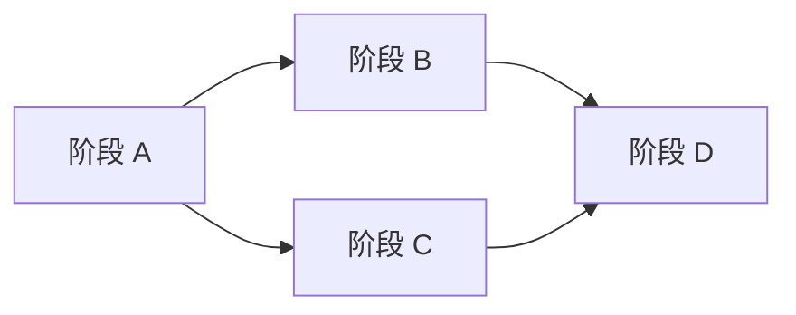

# Go Agent Runtime — 任务清单

勾选表示完成。详细说明与验收口径见 [`go-runtime-development-plan.md`](go-runtime-development-plan.md)、[`agent-runtime-golang-plan.md`](agent-runtime-golang-plan.md)。

---

## 工程基线（开工前）

- [x] 新建 Go 模块仓库；全局使用 `log/slog`；目录不使用 `internal`（按团队约定）
- [ ] 新功能开发前阅读对应设计：`claude-code-main-flow-analysis.md`、`claude-code-memory-system.md` 等（见 [`README.md`](README.md)）
- [ ] 尽早落地 **token / 字节预算**（避免 Memory 阶段大改）

---

## 阶段 A — 最小闭环

**验收**：同 session 多轮对话 + 多轮工具调用；Abort 可停；transcript 可序列化/持久化。

- [x] **A1** 统一消息模型：user / assistant / tool_use / tool_result / attachment；compact boundary 占位
- [x] **A2** 会话编排：每轮输入 → transcript → 进入 query；跨轮保留 messages、usage、abort
- [x] **A3** query 循环：模型 → tool_use → 执行 → tool_result 回灌 → 无 tool 或达上限/预算则结束
- [x] **A4** 模型后端：选定一种供应商；流式响应；解析 tool 调用块
- [x] **A5** 工具注册与执行：JSON schema、按名查找、`CanUseTool` 类钩子；只读并行、写串行
- [x] **A6** 最小工具：Read；Write 或 StrReplace；Grep；Bash（cwd / 超时 / 策略）
- [x] **A7** `ToolUseContext`：abort、只读缓存、权限上下文；为 nested memory 等预留字段
- [x] **A8** 测试与入口：消息往返单测；CLI 或 REPL 式多轮对话 demo

---

## 阶段 B — Memory 全链路

**验收**：切换目录/scope 发现正确；下一轮能注入更新后的 memory；recall 不爆 token。

- [x] **B1** 存储与路径：user / project / local / agent / team scope；`MEMORY.md` 索引；topic 文件；daily log append
- [x] **B2** `MEMORY.md` 截断：行数上限 + 字节上限 + 截断提示文案
- [x] **B3** 发现层：自 cwd 向上查找 `AGENT.md`、`.oneclaw/rules/*.md`、memory 根
- [x] **B5** 注入与 recall：system 前缀拼装；recall → attachment；surfaced 字节上限、路径去重
- [x] **B6** 在线更新：工具可写 topic、`MEMORY.md`、daily log
- [x] **B7** extract / dream：窄上下文子任务入口 + 触发策略（回合结束/定时）；合并去重（可先简化）

---

## 阶段 C — 子 Agent 与隔离

**验收**：主 transcript 不被子任务撑爆；fork 与全量子 Agent 两条路径符合设计文。

- [ ] **C1** Agent 定义加载：目录或配置驱动
- [ ] **C2** 嵌套调用：子 Agent 内独立 query；默认隔离 `ToolUseContext`
- [ ] **C3** Fork：共享 system 前缀 + 裁剪 messages
- [ ] **C4** sidechain transcript：与主线程分离存储；可选合并回主会话
- [ ] **C5** 权限：子 Agent 默认更保守（如避免交互式授权）

---

## 阶段 D — 运维与可选能力

- [ ] **D1** 维护调度：dream / extract 定时或事件触发；失败用 slog 记录
- [ ] **D2** 变更审计：memory 写入可追溯（git 或 append-only log）
- [ ] **D3**（可选）向量 recall：插件接口；文件仍为真源

---

## 刻意后置（勿在 A 阶段展开）

- [ ] 完整 MCP 客户端与 UI 级权限流
- [ ] 复杂 compact / 全量遥测

---

## 依赖关系（执行顺序）

建议：**A 完成后再并行推进 B 与 C**；D 依赖 B（及与 memory 写入相关的 C 行为）基本就绪后再做。
