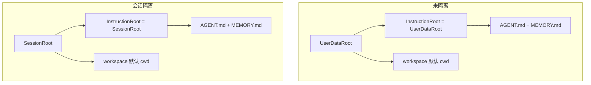

# 用户数据根 + Workspace 目录布局

本文约定 **IM 常驻模式**下「配置 / 说明与规则记忆入口」与「默认干活目录」的拆分方式，以及与 [session-home-isolation-design.md](session-home-isolation-design.md) 的关系。**实现以本文与 `config.Resolved` 派生规则为准逐步对齐**；旧文档中仅描述「SessionHome = CWD」或「`<SessionHome>/.oneclaw` 整树」的段落，在落地本布局后应视为被本文细化或替代。

**路径约定**：用户数据根目录名为 `~/.oneclaw`（或 `paths.memory_base`）；**在该目录树内不再出现嵌套的子目录名 `.oneclaw`**（运行时与 episodic 等直接落在 `memory/`、`tasks.json`、`audit/` 等路径下）。**推荐心智**：只需配置好用户数据根；按仓库/工作目录区分的自动记忆落在 **`<memory_base>/projects/<slug>/`** 即可，**不依赖**在独立仓库里再建 `<repo>/.oneclaw/`。历史实现里 `memory.DefaultLayout` 仍可能把部分 project 路径指到 `<cwd>/.oneclaw/...`，后续可收敛为与上表一致。

---

## 1. 背景与目标

**问题**

- **未开启会话隔离**时，若用户数据根与默认 `cwd` 混在同一层，用户容易在「配置、AGENT、记忆入口」与「日常编辑的仓库/文件」之间误操作。
- **开启会话隔离**时，若把说明类文件深埋在 `sessions/<id>/.oneclaw/` 下，路径不直观，也与「用户根一套、会话根一套」的心智不一致。

**目标**

1. **`UserDataRoot`（默认 `~/.oneclaw`）**：承载用户级配置、全局会话索引、以及**未隔离模式**下的说明与规则记忆入口。
2. **`Workspace`**：在数据根下使用**固定子目录名 `workspace/`**，作为 **默认 `Engine.CWD` / 文件工具默认工作目录**（exec、read/write 的相对路径锚点等，仍以工具策略为准）。
3. **会话隔离**时：将 **`~/.oneclaw/sessions/<session_id>/` 视为「该会话的 `~/.oneclaw`」**，其下目录结构与未隔离时的 **`~/.oneclaw` 相对布局一致**（同一套机制，不同根路径）。

---

## 2. 术语

| 术语 | 含义 |
|------|------|
| **UserDataRoot** | 用户级数据根，默认 `~/.oneclaw`（或由 `paths.memory_base` 等解析，与现有 `config` 一致）。 |
| **SessionRoot** | 会话级数据根：`filepath.Join(UserDataRoot, "sessions", session_id)`。仅在**开启会话隔离**时作为该会话的「小用户根」使用。 |
| **InstructionRoot** | **存放 `AGENT.md` 与 `MEMORY.md` 的目录**（二者**必须同目录**，见 §3）。未隔离时为 `UserDataRoot`；隔离时为 `SessionRoot`。 |
| **Workspace** | `<InstructionRoot>/workspace`（路径名固定为 `workspace`），默认 cwd，承载用户主动管理的项目、附件、临时产出等。 |

---

## 3. 不变量（必须满足）

- **`MEMORY.md` 与 `AGENT.md` 位于同一目录**，即同一 **InstructionRoot** 下，路径形如：
  - `<InstructionRoot>/AGENT.md`
  - `<InstructionRoot>/MEMORY.md`
- **其它**路径（日更 episodic、tasks、exec 日志、审计、mediastore 等）**不强制**与 InstructionRoot 同层；实现可沿用现有 `memory.Layout`、`Resolved` 派生规则，**只要不与「AGENT / MEMORY 同目录」冲突**即可。

---

## 4. 目录结构示意

### 4.1 未开启会话隔离

`InstructionRoot` = `UserDataRoot`。

```text
~/.oneclaw/
  config.yaml
  AGENT.md
  MEMORY.md                 # 与 AGENT.md 同目录（§3）
  rules/                    # 可选
  memory/                   # 日更 episodic、dialog_history 等（与 rules 并列，无嵌套 .oneclaw）
  tasks.json                # 可选：会话运行时任务列表
  audit/                    # 可选：审计 JSONL
  usage/                    # 可选：用量落盘
  sessions.sqlite           # 或其它用户级索引，按现有约定
  sessions/                 # 每会话 transcript 等（见 Resolved）
    <session_id>/
      transcript.json
      working_transcript.json
  workspace/                # 默认 cwd；附件等可落在 workspace/media/inbound/…
```

说明：`sessions/<id>/` 在未隔离模式下为**会话元数据 / 转写**等落点，**不**作为 InstructionRoot；InstructionRoot 仍在 `~/.oneclaw`。

### 4.2 开启会话隔离

`InstructionRoot` = `SessionRoot` = `~/.oneclaw/sessions/<session_id>/`，与全局 `~/.oneclaw` **同一套相对布局**（小用户根）。

```text
~/.oneclaw/
  config.yaml               # 全局配置（合并策略见 config 文档）
  AGENT.md                  # 可选：全局基线说明
  MEMORY.md                 # 若存在全局基线，与全局 AGENT 同目录
  rules/
  sessions/
    <session_id>/
      AGENT.md              # 可选：本会话覆盖/增量
      MEMORY.md             # 与本会话 AGENT.md 同目录（§3）
      rules/                # 可选
      memory/
      workspace/            # 本会话默认 cwd
      transcript.json       # 本会话转写（与 Resolved 一致）
      working_transcript.json
```

**合并策略**（与 [session-home-isolation-design.md](session-home-isolation-design.md) §7 一致）：全局 `UserDataRoot` 下的 `AGENT.md` / `rules/` 为基线；会话目录下可为覆盖或增量，产品需 **二选一并写死**（拼接或覆盖优先级）。

---

## 5. 路径解析关系



---

## 6. 与 OpenClaw 的简要对照

[OpenClaw Agent Workspace](https://github.com/openclaw/openclaw/blob/main/docs/concepts/agent-workspace.md) 将 **AGENTS.md、memory/、MEMORY.md 等放在 `~/.openclaw/workspace` 内**，workspace 即「agent home」。**本布局**将 **`AGENT.md` / `MEMORY.md` 固定在 InstructionRoot（数据根）**，**`workspace/` 仅作默认 cwd**，说明类与「用户日常操作树」分离更强；**不变量仍是 AGENT 与 MEMORY 同目录**。

---

## 7. 实现与迁移提示

| 项 | 说明 |
|----|------|
| **CWD** | `MainEngineFactory` / `Engine`：默认 `CWD = filepath.Join(InstructionRoot, "workspace")`（需在创建目录时 `MkdirAll`）。 |
| **memory.Layout** | `layout.CWD` 与「规则 MEMORY 入口」路径应对齐 InstructionRoot + `MEMORY.md`；episodic、project memory 等其它根路径按现有 `DefaultLayout` 演进，避免把规则入口指到与 `AGENT.md` 不同目录。 |
| **迁移** | 从旧「嵌套 `~/.oneclaw/.oneclaw/` 或 `sessions/<id>/.oneclaw/`」迁出时：将文件挪到上表所示无嵌套 `.oneclaw` 的路径，并保证 **MEMORY.md 与 AGENT.md 已同目录**。 |

---

## 8. 小结

- **双根心智**：**InstructionRoot**（配置 + AGENT + MEMORY + rules…）与 **`workspace/`**（默认干活目录）分离；未隔离与隔离仅换「根」路径，**相对结构一致**。
- **硬约束**：**`MEMORY.md` 与 `AGENT.md` 始终同目录**；**用户数据根目录树内不出现嵌套的 `.oneclaw` 子目录名**；其余运行时文件布局以代码与 `Resolved` 为准。
