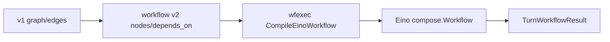

# Workflow 架构评审（v2）

本文记录 oneclaw 从 v1 Graph 迁移到 v2 Workflow 的最终状态，作为当前实现口径。

## 1. 架构结论

- 解析层：`workflow.ParseBytes` 只接受 `workflow_spec_version: 2`，主模型为 `nodes` + `depends_on`（`steps` 仅语法糖）。
- 执行层：`wfexec.Execute` 统一走 `CompileEinoWorkflow`，底座是 Eino `compose.Workflow`。
- 数据流：用户层默认字符串流转；`$nodes.<id>` 等价 `$nodes.<id>.text`。
- 运行时：`RuntimeContext` 作为节点执行环境注入，非 Workflow 主 I/O。
- 返回结果：`TurnWorkflowResult` 仅保留 `assistant` 与 `runtime`，不再汇总 `nodes`。
- 异步：`async: true` 保持 fire-and-forget 语义，主链路不被 post-turn 任务阻塞。

## 2. 节点语义（当前）

- `on_receive`：入口检查与输入归一化。
- `llm`：主 LLM/ADK 节点；可选 `agent_type` 指向其它 agent。
  - 当宿主提供入站 `MediaPaths` 时：运行时会先将附件落盘到 `workspace/inbound/`，再把这些路径注入用户消息（`Context attachment`）；若当前模型判定支持图像输入，则会额外以内联图片多模态 part 传给 LLM（受大小/数量限制）。
- `on_respond`：以显式输入文本作为 assistant 输出并落 transcript。
- `agent_task`：显式子 agent 任务（必须 `agent_type`）。
- `structured_memory_extract`：读取宿主 Run Journal（PostTurn ctx / 路径），确定性写入结构化记忆管线。
- `command`：等同 **`exec` 策略** 的 workspace shell（`tools.exec` + allow/deny）。
- `tool_call`：`ToolRegistry` 上单次 **`InvokableRun`**（禁止 **`run_agent`**）。
- `retrieve_context`：文本 passthrough 占位。

## 3. 默认模板形态

- `default.turn`：`on_receive -> llm -> on_respond -> async agent_task(memory/skill)`，`memory_agent` 与 `skill_agent` 固定由宿主触发，`agent_task` 输入 **`$runtime.post_turn.ctx`**，`end: respond`。
- `memory_extractor.turn`：`on_receive -> structured_memory_extract -> noop`（PostTurn YAML 经 **`$start.user_prompt`**；可选仍可用 **`$nodes.receive`**，依赖 §3 所述合并形态）。
- `skill_generator.turn`：`on_receive -> journal_tool_metrics -> if -> llm -> on_respond`。`if` 在编译时映射到 Eino 原生 `AddBranch`，未命中条件时分支直达 `END`，不会进入提取路径。

## 4. 风险与后续

- `RuntimeContext` 仍承担较多共享状态，后续可继续收敛到更清晰的 turn state 分层。
- `retrieve_context` / `command` / `tool_call` 的高级结构化输出尚可继续增强。
- 当前已保证文档、模板与执行实现一致；后续新增 node 能力时需同步更新 [workflows-spec.md](workflows-spec.md)。

## 5. 迁移流程图

## 6. 变更记录

- 2026-05-05：完成 v2 迁移，移除 v1 Graph 主执行路径与旧默认模板。
- 2026-05-06：PostTurn **`$runtime.post_turn.ctx`**；**`structured_memory_extract`**；**`memory_extractor.turn`** 改为确定性抽取链路。
- 2026-05-06：**`command`** / **`tool_call`**  workflow 节点接入 **`exec`** 与 **`ToolRegistry`**。
