# Workflow 架构评审与优化路线

本文记录对 **oneclaw 当前 workflow 实现**（YAML → `workflow` 校验 → Eino `compose` → `wfexec` → `engine.RuntimeContext`）的架构结论与 **优化 / 简化** 建议，便于评审与分阶段落地。与 **[workflows-spec.md](workflows-spec.md)**（规范）、**[architecture.md](architecture.md)**（主流程）互补：**规格写什么**看 workflows-spec；**代码侧复杂度与还债顺序**看本文。

**维护约定**：落地某项建议后，可在下文对应小节勾选或更新「状态」，避免文档与代码长期脱节。

| 字段 | 说明 |
|------|------|
| 状态 | 未开始 / 进行中 / 已完成 / 已否决 |
| 适用版本 | 以仓库实现为准；本文首版对齐 workflow_spec_version 1 + Phase3 builtins |

---

## 实现进度一览（与 §4 对照）

| 跟踪项 | 状态 | 说明 |
|--------|------|------|
| §4.1 四阶段模型 + 稳定 `id` | **已完成** | **`setup/templates/workflows/default.turn.yaml`** 阶段注释与 **`id: adk_main` / `on_respond`**；**[architecture.md](architecture.md)** §2.1；**[docs/README.md](README.md)** 索引表含 **四阶段 + 模板路径**；模板顶注可选 **`filter_tools`** |
| §4.1 `stream` 增量下发 | **已完成** | `workflow.ReplyStreamEnabled`、`runner.PostAssistantChunk`、`serve` `Reply`/`EditMessage`；**[workflows-spec.md](workflows-spec.md)** 内置表已交叉引用 |
| §4.2 节点产出 wrap / `EmitNodeOutput` | **已完成** | **`engine.RuntimeContext.EmitNodeOutput`**；`adk_main` / `on_respond` 已改用 |
| §4.3 context 契约矩阵 | **已完成** | **矩阵见 §4.3**；**[workflows-spec.md](workflows-spec.md)** §6 **维护约定** 指向本表；**`user_source`** 已删除 |
| §4.4 占位节点合并或标注 | **已完成** | **`default.turn.yaml`** 注释 **`load_prompt_md`**；顶注 **`filter_tools`**；**workflows-spec** §6 表注明 oneclaw **no-op / 扩展位** |
| §4.5 builtin 单表生成 whitelist | **已完成** | **`workflow.Phase3BuiltinUses`** → **`init` 填充 `Phase3Uses`**；**`RegisterPhase3Builtins`** 按 slice 注册 **本地 handler map** |
| §4.6 `if` 与读者预期对齐 | **已完成** | **[workflows-spec.md](workflows-spec.md)** §6 文前增加 **oneclaw** 侧提示框 |
| §4.7 runner 完结点与 journal | **暂缓** | |

---

## 1. 现状快照

| 层级 | 实际形态 |
|------|-----------|
| **文档模型** | `steps` 糖展开为 **单入口 DAG**；节点含 `use`、`params`、`async`。规格中的 **`use: if`** 在加载期 **被拒绝**（见 `workflow/validate.go`）；**[workflows-spec.md](workflows-spec.md)** §6 已标明 **oneclaw** 不支持图内 `if`。 |
| **执行引擎** | 每回合 **编译** Eino Graph；join 用 `WithOutputKey` + `coalesceRTX`；多 sink 用 `_oneclaw_sink` merge（见 `wfexec/compose.go`）。 |
| **异步语义** | `async: true`：**启动 goroutine 即视为节点成功**；handler 内持 `ExecMu`；部分读路径使用 `ReadSnapshot`（见 `engine/read_snapshot.go`、`wfexec/compose.go`）。 |
| **用户可见流式（可选）** | **`on_respond.params.stream`** 或 **`adk_main.params.stream`**（合并 `defaults` 后）为真 → **`workflow.ReplyStreamEnabled`**；`runner` 挂载 **`OnAssistantChunk`**；**`serve`** 用 **`Reply` + `EditMessage`**（见 §4.1）。 |
| **副作用承载** | 高度集中在 **`engine.RuntimeContext`**：ADK、transcript 回放、`PromptTemplateData`、`WorkflowNodeOutputs`、`Assistant`、`CurrentParams`、异步 completion 等。 |
| **内置节点** | **`workflow.Phase3BuiltinUses`** 单源驱动 **`Phase3Uses`**（校验）与 **`RegisterPhase3Builtins`**（注册）；测试仍可 **改写 `Phase3Uses`** 注入临时 kind。部分 handler 接近 **no-op**（如 `load_prompt_md`、`filter_tools`）。 |
| **子 Agent 输入** | **`params.context[]`**（`workflow/agent_context.go` + `wfexec/agent_context.go`）；**`run_journal`** 多种 **`as`**。**`workflow_node`** 读 **`WorkflowNodeOutputs`**（**`RuntimeContext.EmitNodeOutput`**，`wfexec/builtins.go`）。 |

---

## 2. 设计优点（建议保留）

- **DAG 校验**：拓扑、可达性、`ValidateComposeFanOut` 与 Eino「扇出—汇合」限制对齐，减少运行时歧义。
- **async 与主路径分离**：符合「先 respond、再后台演进」的产品语义（与 workflows-spec §4.3 一致）。
- **`params.context` 方向**：把子 Agent 输入从散落 Go 分支抽成 **声明式**，便于扩展 `ref` / `as`。
- **Journal 读取下沉**：`session/run_journal_read.go` 与 `read_run_journal` 工具共享逻辑，边界清晰。

---

## 3. 主要复杂度与风险

### 3.1 `RuntimeContext` 职责过重

workflow、ADK、会话文件、模板数据、异步状态在同一块可变结构上叠加，**字段生命周期**不直观，测试隔离与并行演进成本高。

### 3.2 同步 / 异步与快照混用

异步节点依赖快照字段与 live `rtx` 的组合语义；**journal 完整性**（如 `run_complete`）历史上依赖工具侧重试或 runner 写入顺序，**心智负担高**，需在运维/文档层写清。

### 3.3 占位节点偏多

链上一串节点中，部分长期 **无实质行为**，增加 YAML 阅读成本与「哪一步真干事」的困惑。

### 3.4 `workflow_node` 产出依赖约定

漏调用 **`EmitNodeOutput`** 则无条目；字段名为自由字符串，**编排与实现易漂移**（矩阵 + **`workflows-spec`** §6 维护约定约束演进）。

### 3.5 规格与实现缺口（`if`）

**workflows-spec** §6.1 正文仍是 **通用** `if` 规范；**oneclaw** 在 **§6 文前** 已有 **提示框**：加载期 **拒绝** `if`（`workflow/validate.go`）。读者若只做 oneclaw，应 **先读提示框** 再读 §6.1。

### 3.6 内置清单一致性（已收敛）

**`workflow.Phase3BuiltinUses`** 驱动 **`Phase3Uses`** 与 **`RegisterPhase3Builtins`**；注册侧缺 handler 会在启动注册时报错。

### 3.7 每回合全量编译 Compose

默认 turn 图很小，通常非瓶颈；workflow 变复杂后可评估 **按 workflow id 缓存 Runnable**。

---

## 4. 优化与简化建议（按推荐优先级）

### 4.1 收敛「回合阶段模型」（概念层）

**目标**：读 workflow 的人先建立 **「四段式」心智模型**，再映射到具体 `use` 节点；不把「每一步 YAML 行」当作一级认知单元。

**阶段划分（推荐命名）**

| 阶段 | 含义 | 典型 `use`（默认 turn） | 同步性 |
|------|------|-------------------------|--------|
| **PreparePrompt** | 校验入站、拼装系统侧上下文（skills / tasks / memory 摘要 / transcript 回放列表等） | `on_receive` → `load_prompt_md` → `load_memory_snapshot` → `list_skills` → `list_tasks` → `load_transcript` | 全同步 |
| **RunMainADK** | 主 Agent 一次工具调用对话 | `adk_main` | 同步 |
| **Respond** | 对用户可见回复收尾（transcript、Bus 等） | `on_respond` | 同步 |
| **PostTurnAsync** | 用户已拿到回复后的后台枝 | `agent`（如 `memory_extractor` / `skill_generator`）+ `async: true` | 异步，不阻塞 DAG 前进 |

**RunMainADK 期间的增量下发（可选，降低首字延迟）**

- **行为**：在 **RunMainADK** 过程中，模型每产出一段 **可展示的助手文本**，可 **尽快发到渠道**；不关心延迟则省略开关，仍在 **Respond** 阶段一次性收口（与原先一致）。
- **Workflow 开关（已实现）**：当 **`on_respond.params.stream`** 或 **`adk_main.params.stream`** 为真（经 `defaults` 合并后，`workflow.ReplyStreamEnabled`），`runner.ExecuteTurn` 为 `RuntimeContext` 挂载 **`OnAssistantChunk`** → **`runner.Params.PostAssistantChunk`**（由宿主提供）。
- **`oneclaw serve`**：`PostAssistantChunk` 使用 **`Bridge.Reply`**（首段）+ **`Bridge.EditMessage`**（后续累积全文）；最终 **`PostAssistantRespond`** 再 **`EditMessage`** 一次对齐完整答复；若驱动不支持编辑则降级为 **`Reply`**（可能多发一条）。依赖 clawbridge 驱动的 **MessageEditor**（如 webchat SSE `edit`）。
- **CLI `run`**：未传 `PostAssistantChunk`；仍通过 **`Stdout`** 在 **`OnAssistantChunk` 未设置时** 打印各 chunk（`wfexec`：`OnAssistantChunk != nil` 时不写 Stdout，避免与渠道重复）。
- **与阶段边界**：transcript / runs 仍以既有 **`on_respond` / runner** 为准；增量仅影响 **用户可见 outbound** 时序。

**与图结构的关系**

- 上述阶段在 **实现上仍是线性 DAG 上的节点序列**（`steps` 展开）；**不要求**新增引擎里的「阶段类型」字段。
- **PreparePrompt** 内部顺序可有微调（例如清单工具顺序），但应保持在同一认知桶内，避免对外文档按十几个节点罗列。

**稳定节点 `id`（强烈建议）**

- 为 **`adk_main`**、**`on_respond`** 及任何需要被 `params.context` → `workflow_node` 引用的节点配置 **显式 `id:`**（模板见 `setup/templates/workflows/default.turn.yaml`）。
- 约定：`workflow_node.select.node_id` 优先引用这些 **语义 id**（如 `adk_main`），避免依赖 `step_6` 等展开序号。

**与 `WorkflowNodeOutputs` 的挂钩（演进方向）**

- 产出键建议与阶段对齐：`adk_main` 节点写入主模型侧产物（如 `assistant_text`、`user_prompt`）；`on_respond` 写入对外发送相关标记（如 `transcript_flush`）。
- 后续若引入 **阶段别名**（例如 `rtx.RecordPhaseOutput("RunMainADK", …)`），也应 **落在上述 id 或固定枚举上**，而不是新增一套与图 id 无关的名字。

**文档与模板动作（落地情况）**

- **默认 turn 模板**：`setup/templates/workflows/default.turn.yaml` 顶部 **一行阶段映射注释**；`on_respond` 旁 **`stream` 可选**说明。
- **architecture.md**：§2.1 增加 **四阶段 ↔ 默认节点区间** 与指向本文 §4.1 的链接。
- **运维 README**：若仓库另有入口文档，可同一句话复述（可选）。

**收益**：降低节点枚举的认知负载；子 Agent 与 `workflow_node` ref 有稳定锚点。

**成本**：主要是文档与模板约定；引擎可后移。

**状态**：**已完成**（含 **`docs/README.md`** 索引一行 + 模板路径）

---

### 4.2 统一「节点产出」机制（实现层）

**落地**：**`engine.RuntimeContext.EmitNodeOutput`**（按 **`CurrentNodeID`** 合并进 **`WorkflowNodeOutputs`**）。**`wfexec`** 中 **`adk_main`** / **`on_respond`** 已改用；单元测试见 **`engine/node_output_test.go`**。

**收益**：产出写入集中在一处 API，便于文档化与后续 handler wrap。

**成本**：中等；当前仅两处写入，后续新增产出节点应优先走 **`EmitNodeOutput`**。

**状态**：**已完成**

---

### 4.3 收紧 `params.context` 契约（文档 + 弃用）

**`params.context[]` 支持矩阵（当前实现）**

| `ref` | `as`（默认 `user_message`） | `scope` / `select` | 行为摘要 |
|-------|----------------------------|--------------------|----------|
| **`run_journal`** | **`user_message`** | `current_turn`（默认）或 `full` | 宿主读取 JSONL 嵌入 fenced 块；占 token |
| **`run_journal`** | **`tool_binding_only`** | 同上（提示文案） | 只给路径说明 + 要求调用 **`read_run_journal`** |
| **`run_journal`** | **`path_metadata`** | `workflow_scope_hint` 透出 | 仅 **`run_journal_path`**、**`size_bytes`**、**`workflow_scope_hint`**；模型自决是否调工具 |
| **`workflow_node`** | （固定为 JSON 正文） | **`select.node_id`** 必填；**`fields`** 可选 | 从 **`WorkflowNodeOutputs[node_id]`** 取字段；未列 `fields` 则整包 JSON |
| **`transcript`** | （固定为文本） | 使用 **`session.DefaultTranscriptTurnLimit`** 截断 | 会话 **`transcript.jsonl`** 回放为 `role: content` 行 |

子 Agent 节点 **不再** 读取 **`user_source`**；需要 journal 上下文须在 **`params.context`** 中声明 **`run_journal`**（或等价 **`ref`**）。

**待办**

- 若新增 **`ref` / `as`** 或 **`EmitNodeOutput`** 新键，先更新 **本表** 并同步 **[workflows-spec.md](workflows-spec.md)** §6 **维护约定**，再改代码。

**收益**：减少组合爆炸与「口头约定」漂移。

**状态**：**已完成**

---

### 4.4 合并或删除占位节点（YAML 简化）

**落地（本轮）**：未合并节点以免破坏既有图 id；在 **`setup/templates/workflows/default.turn.yaml`** 为 **`load_prompt_md`** 增加 **no-op / 扩展位** 注释，顶注说明 **`filter_tools`** 可选；**[workflows-spec.md](workflows-spec.md)** §6 内置表对 **`load_prompt_md`** / **`filter_tools`** 标明 **oneclaw** 语义。

**收益**：读者知道哪些步骤可删或可插插件。

**成本**：进一步缩短 YAML 需单独迁移里程碑。

**状态**：**已完成**（标注 + 规格表；非「删除节点」）

---

### 4.5 单一注册来源（builtin 清单）

**落地**：**`workflow.Phase3BuiltinUses`**（slice）在 **`init`** 中填充 **`Phase3Uses`**；**`wfexec.RegisterPhase3Builtins`** 遍历同一 slice，从 **本地 `map[string]Handler`** 注册；缺 handler 即报错。**`wfexec/compose_async_test.go`** 等仍可 **改写 `Phase3Uses`** 注入测试用 kind。

**收益**：消灭双表漂移类 bug。

**成本**：低。

**状态**：**已完成**

---

### 4.6 规格与实现对齐：`if` **不在 Phase3 范围**

**决议（oneclaw）**：**现阶段不实现 `use: if`**。加载期继续拒绝含 `if` 的 workflow。

**配套动作**：已在 **[workflows-spec.md](workflows-spec.md)** §6 **文前**增加 **oneclaw** 提示框：加载期拒绝 **`use: if`**；分支需求用 **多条 workflow / manifest / 应用开关**。§6.1 正文保留为 **通用规范 / Future**。

**收益**：读者与贡献者不再假设「规格写了就一定能用」。

**成本**：低（已完成）。

**状态**：**已完成**

---

### 4.7 异步与 journal 一致性（可选加固）

**建议**：若希望弱化工具内重试，可在 runner 层定义 **sync 完结点**（例如确保 `run_complete` 落盘后再调度 async 子图）。

**收益**：语义更简单。

**成本**：调度模型变更，单独里程碑。

**状态**：**暂不处理**（当前不纳入迭代；保留条目仅供将来召回）。

---

## 5. 路线图总览

```mermaid
flowchart LR
  subgraph done [已完成]
    X[stream + ReplyStreamEnabled]
    Y[四阶段注释与 architecture 口径]
    Z[workflows-spec if 侧提示]
    A[单表 Phase3BuiltinUses]
    B[删除 user_source]
    R[docs/README 四阶段索引]
    O[EmitNodeOutput]
    P[占位节点文档化]
  end
  subgraph quick [短期低成本]
    C[运维入口 README 可选复述]
  end
  subgraph mid [中期]
    D[handler 自动 wrap 节点元数据]
    E[合并占位 YAML 节点]
  end
  subgraph strat [战略]
    F[RuntimeContext 分域或 TurnState]
  end
  done --> quick
  quick --> mid
  mid --> strat
```

---

## 6. 一句话结论

当前 workflow **表达能力已够用**：**图内 `if`** 明确 **不在** oneclaw Phase3，**规格与读者预期已对齐**；**可选流式回复** 已按 **`stream`** 落地 **`serve`**。**builtin 清单**、**`params.context`**、**节点产出 API（`EmitNodeOutput`）**、**占位节点文档化** 已按 §4.5–§4.2 / §4.4 收敛。剩余技术债主要在：**上帝 RuntimeContext**、**异步与快照混用**。**async 与 `run_complete` 顺序（§4.7）** 仍 **暂缓**。

---

## 7. 相关链接

- [workflows-spec.md](workflows-spec.md) — DAG、`async`、`use: agent`、§4.3 / §8
- [architecture.md](architecture.md) — 主路径与 PostTurn 阶段别名
- [eino-md-chain-architecture.md](eino-md-chain-architecture.md) — Eino 挂载与编排
- [appendix-data-layout.md](appendix-data-layout.md) — `sessions/`、`runs/` 布局

| 日期 | 变更 |
|------|------|
| 2026-05-04 | 首版：架构评审与优化路线 |
| 2026-05-04 | §4.1 细化四阶段与稳定 id；§4.6 明确不支持 `if`；§4.7 标为暂不处理；路线图去掉 deferred 项 |
| 2026-05-04 | §4.1 补充 RunMainADK 可选增量下发与 `OnAssistantChunk` / workflow 参数演进 |
| 2026-05-04 | 实现 `stream` + serve Reply/EditMessage；`workflow.ReplyStreamEnabled`；runner `PostAssistantChunk` |
| 2026-05-04 | 全文对齐：实现进度表、§4.3 矩阵、§4.6 完成态、路线图 **done**；`workflows-spec` §6 提示框；`architecture` / 模板四阶段注释 |
| 2026-05-04 | §4.5 **`Phase3BuiltinUses`** + **`RegisterPhase3Builtins`** 单源；§4.3 移除 **`user_source`** / **`UserSourceParam`** |
| 2026-05-04 | §4.2 **`EmitNodeOutput`**；§4.4 模板/规格标注占位节点；§4.1 **`docs/README`**；§4.3 ↔ **`workflows-spec`** §6 维护约定 |
