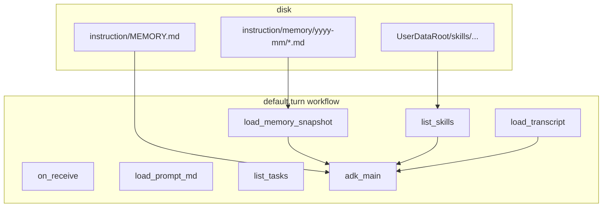
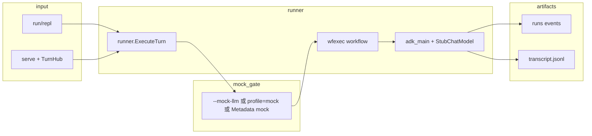

# oneclaw 端到端测试用例设计（基于 mock_llm）

## 1. 目的与范围

- **目标**：在**不依赖真实大模型 API** 的前提下，验证从用户输入到工作流执行、会话落盘、回复输出的主路径行为。
- **范围**：CLI `run` / `repl`、长期服务 `serve` 的入站处理；子 Agent 委托在 mock 下同样走 `NewToolCallingChatModel(..., useMock)`，可一并纳入回归。
- **非目标**：真实模型质量、流式 `Stream`（stub 未实现，见 `adkhost/stub.go`）、各渠道驱动特有的网络行为。

## 2. mock_llm 行为说明

| 项 | 说明 |
|----|------|
| 固定回复 | `adkhost.NewStubChatModel` 在 `useMock` 时使用文案 **`Hello from oneclaw stub model.`**（`adkhost/resolve.go`） |
| 触发条件 | `Params.UseMock == true`，或 **model profile 的 `provider` 为 `mock`（不区分大小写）**（`runner.ExecuteTurn`） |
| 运行记录 | `runs/...` 中 `run_start` 事件的 `Detail.mock_llm` 为 `true`（`runner/runner.go`） |
| 入站元数据 | clawbridge 消息上 **`oneclaw.mock_llm`** 为 `1` / `true` 时，单条消息强制 mock（`cmd/oneclaw/serve.go`） |

## 3. 三种启用 mock 的方式（测试需分别覆盖）

1. **CLI 全局**：`oneclaw run --mock-llm ...` 或 `oneclaw serve --mock-llm`（全量进线使用 stub）。
2. **配置 profile**：`config.yaml` 中某 profile `provider: mock`（无需传 `--mock-llm` 即走 stub）。
3. **单条入站**（仅 serve）：`Metadata["oneclaw.mock_llm"] = "true"`，在**未**开 `serve --mock-llm` 时仅该条使用 stub。

## 4. 前置条件（所有用例共享）

- 已执行 `oneclaw init`（或等价：存在规范 UserDataRoot、catalog、默认 agent、默认 workflow）。
- 测试使用**独立** `UserDataRoot`（或独立 `--session` / 独立 session id），避免与本地开发数据混用。
- 非「profile=mock」类用例需显式 `--mock-llm`，避免误连真实 API。

## 5. mock_llm 与「工具型」场景的能力边界

**Stub 模型**（`adkhost.StubChatModel`）每轮只返回固定 assistant 文，**不会像真实模型那样产生 tool_calls**。因此：

| 场景 | 纯 `run --mock-llm` 能直接验证什么 | 不能直接验证什么 |
|------|--------------------------------------|------------------|
| Memory recall | workflow `load_memory_snapshot` 是否把 `memory/**/*.md` 树状摘要送进本轮上下文（依赖盘上有文件） | 模型主动 `read_memory_month` 读后回答 |
| Use skills | `list_skills` 是否生成 Skills 摘要；catalog `skills:` 是否注入 `SKILL.md` 正文 | 模型按技能步骤执行任务 |
| Add memory | **预置** `memory/<UTC-yyyy-mm>/*.md` 后，下一轮 recall 是否列出该路径 | 单轮内通过 `write_memory_month` / `append_memory_month` **写入**（需模型调工具或单独工具集成测试） |
| Create skills | **预置** `skills/<skill-id>/SKILL.md` 后，索引/引用是否出现 | 单轮内 `write_skill_file` **创建**技能目录（同上） |

补充：`memory_extractor` / `skill_generator` 子 agent 在 mock 下同样使用 stub，**不宜期望**其像真实模型一样稳定写入 `memory/` 或 `skills/`；E2E 文档以「主路径无报错 + 异步步完成」为主，写入类应优先 **预置文件** 或 **Go 集成测试直接调工具**。

## 6. 用例列表

| ID | 名称 | 触发方式 | 主要步骤 | 预期结果 |
|----|------|----------|----------|----------|
| E2E-01 | 单次对话主路径 | `run --mock-llm` | `oneclaw run --mock-llm -config <root>/config.yaml --session e2e-01 --prompt "ping"` | 标准输出出现 stub 固定句；`run_start` 中 `mock_llm: true`；`transcript.jsonl` 含用户与 assistant 轮次（或经 `on_respond` 落盘，与实现一致） |
| E2E-02 | 空 prompt 拒绝 | `run --mock-llm` | `run` 时 `--prompt ""` 或仅空白（若 flag 允许） | 在 `on_receive` 前失败；**不**应产生完整 `run_complete`（与 `wfexec` 校验一致） |
| E2E-03 | `/reset` 仅清 transcript | `run --mock-llm` | 先跑一轮写入 transcript；再 `--prompt /reset` | 第二次输出包含「已清除本会话的用户侧对话记录」类确认；后续再跑一轮时 `load_transcript` 不再带回首轮用户句 |
| E2E-04 | 会话隔离 | `run --mock-llm` | 同 `--prompt`，`--session e2e-A` 与 `e2e-B` 各一次 | 两套 session 目录下 transcript 互不覆盖 |
| E2E-05 | 指定 agent | `run --mock-llm` | `--agent <id>` 指向存在的 catalog agent | 工作流解析为该 agent 绑定的 workflow；`run_start` 中 `workflow` 字段与默认 agent 可区分（若配置不同） |
| E2E-06 | serve 全局 mock | `serve --mock-llm` | 启动 serve 后通过 WebChat/TurnHub 发一条消息 | 回复为 stub 固定句；日志含 `using stub ChatModel` |
| E2E-07 | serve 单条 metadata mock | 无全局 `--mock-llm` | 一条消息带 `oneclaw.mock_llm=true`，另一条不带 | 仅第一条为 stub 回复；第二条行为依赖 profile（真实 key 或失败），用于验证**按条**覆盖 |
| E2E-08 | profile provider=mock | 配置 `provider: mock` | 不传 `--mock-llm` 执行 `run` | 行为与 E2E-01 一致，`mock_llm` 仍为 true |
| E2E-09 | 异步 memory/skill 子 agent | `run --mock-llm` | 使用默认 `default.turn`（含 `memory_extractor` / `skill_generator` 异步步） | 主路径成功；异步子 agent 在 mock 下同样不访问真实模型（若 CI 需稳定，可单独限制并发或延长等待后检查 runs） |
| E2E-10 | Memory recall（文件真源） | `run --mock-llm` | 在**本轮 instruction root** 下预置 `memory/<UTC-yyyy-mm>/e2e-recall.md`（内容任意短文本）；`--session e2e-mem`；`-log-level debug` 或 `ONECLAW_VERBOSE_PROMPT=1` | `load_memory_snapshot` 阶段生成的 **Memory recall** 块在日志/冗长 prompt 中出现该路径或文件名；`preturn.MemoryRecallSection` 提示使用 `read_memory_month` 读月度文件 |
| E2E-11 | Use skills（索引与注入） | `run --mock-llm` | 在 `<UserDataRoot>/skills/<skill-id>/SKILL.md` 预置最小技能正文；catalog 中默认 agent（或专用 agent）**frontmatter `skills:`** 声明该 `skill-id` | `list_skills` 产出非空 **SkillsIndex**；系统提示中可见引用技能的摘要/正文注入（与 `preturn.SkillsDigestMarkdown`、`ReferencedSkillsIndexMarkdown` 行为一致）；**不要求** stub 回复引用技能内容 |
| E2E-12 | Add memory（写入路径） | 分层 | **A. 管道**：手工或脚本创建 `memory/<UTC-yyyy-mm>/note.md` 后执行 E2E-10，验证 recall。**B. 工具契约**：在 `go test` 中对 `InferWriteMemoryMonth` / `InferAppendMemoryMonth` 绑定 registry 直接 `Invoke`（非 CLI stub）。**C. 真实模型**：可选冒烟，验证端到端写入 | A+B 可在无 API Key 下稳定跑；C 不属于 mock_llm 本文档必填 |
| E2E-13 | Create skills（写入路径） | 分层 | **A. 管道**：预置 `skills/<id>/SKILL.md` 后跑 E2E-11。**B. 工具契约**：`go test` 调 `InferWriteSkillFile` 写入允许扩展名。**C. `skill_generator` 异步**：mock 下仅断言工作流不报错、runs 有子任务轨迹，**不**强断言磁盘上新技能 | 与 E2E-12 相同分层策略 |
| E2E-14 | MEMORY.md 快照 | `run --mock-llm` | 在 instruction root 写入 `MEMORY.md`（短于预算），跑一轮 | `adk_main` 组装提示时包含 MEMORY 块（与 bootstrap `default` 说明一致）；可与 E2E-10 同会话对比「滚动摘要 vs memory/ 树」 |

## 7. 断言检查点（建议自动化时采集）

- **进程退出码**：成功路径为 `0`。
- **stdout / Reply**：包含 **`Hello from oneclaw stub model.`**（主 agent 直接回复时）。
- **`<SessionRoot>/runs/<agent>/runs.jsonl`**：解析最近一条 `run_start`，`detail.mock_llm == true`。
- **`<SessionRoot>/transcript.jsonl`**：轮次数与用例设计一致（reset 后变短或清空用户侧历史，依 `session.ResetConversation` 语义）。
- **日志**（`-log-level debug`）：`adk_main` 前后无真实 HTTP 到 OpenAI 兼容端点（mock 路径不发起外连）。
- **Memory recall（E2E-10）**：debug / verbose prompt 中含 `## Memory recall` 或预置文件名路径片段。
- **Skills（E2E-11）**：冗长系统提示中含技能 id、`SKILL.md` 摘要或 SkillsIndex 片段。
- **写入类（E2E-12 / E2E-13）**：mock CLI 路径断言**磁盘预置**或 **go test 工具 Invoke**；勿仅凭 assistant 正文判断。

## 8. Memory / Skills 与 workflow 的关系（端到端视角）

- **Recall**：`load_memory_snapshot` → `MemoryRecall`（`preturn.MemoryRecallSection`）；月度正文读取靠工具 **`read_memory_month`**（非 stub 自动调用）。
- **Skills**：`list_skills` → `SkillsIndex`；catalog **`skills:`** 决定注入哪些 `SKILL.md`。
- **写入**：`write_memory_month` / `append_memory_month`（instruction root）；`write_skill_file` / `append_skill_file`（user data `skills/`）。主 Agent 是否调用取决于模型；mock 下请用 §5 分层策略。

## 9. 主路径数据流（端到端）

## 10. 后续自动化建议

- **仓库实现**：`go test ./test/e2e/...` — `runner.ExecuteTurn` + `--mock-llm` 等价路径；`bootstrap` 后替换为 **无异步子 agent** 的 `default.turn.yaml`，避免与 `t.TempDir` 清理竞态。工具写入见 `tools_contract_test.go`。
- 使用 **临时目录** + `ONECLAW_USER_DATA_ROOT`（或项目约定的 root 环境变量）初始化最小 userdata，再调用 `oneclaw run` **子进程**，断言退出码与文件内容。
- CI 中仅依赖 **mock_llm**，不注入 `OPENAI_API_KEY` 等密钥，确保测试失败即暴露「误连真实模型」。
- `E2E-07` 若难以构造 metadata，可通过内部测试桩调用 `runner.ExecuteTurn` 并注入 `Params{UseMock: true/false}` 做组件级补充，与本文档中的「serve 单条」语义对齐即可。
